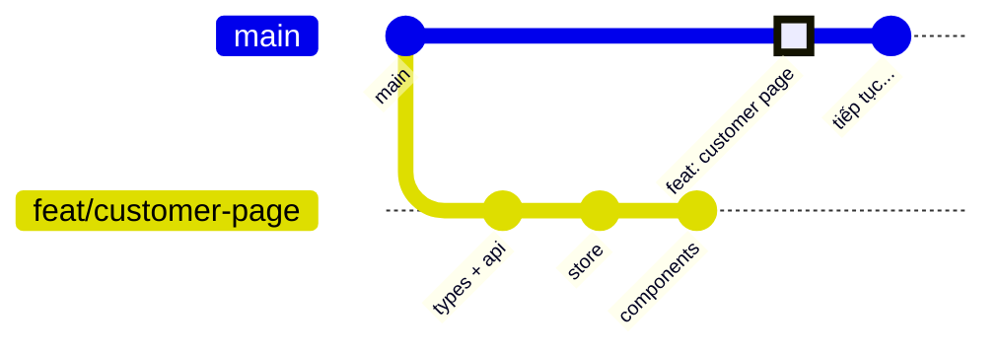

# Quy trình Git — Hotel Management System

Tổng hợp các lệnh Git đã dùng trong project, **xếp theo tình huống** chứ không theo bảng chữ cái. Mỗi lệnh kèm ví dụ thật từ project và câu "khi nào dùng".

## Mục lục

1. [Cài đặt một lần](#1-cài-đặt-một-lần)
2. [Quy ước đặt tên](#2-quy-ước-đặt-tên)
3. [Vòng đời một tính năng](#3-vòng-đời-một-tính-năng)
4. [Xem trạng thái và lịch sử](#4-xem-trạng-thái-và-lịch-sử)
5. [Commit gọn gàng](#5-commit-gọn-gàng)
6. [Cập nhật branch theo main: rebase](#6-cập-nhật-branch-theo-main-rebase)
7. [Xử lý conflict](#7-xử-lý-conflict)
8. [Cất tạm, sửa sai, hoàn tác](#8-cất-tạm-sửa-sai-hoàn-tác)
9. [Dọn branch sau khi merge](#9-dọn-branch-sau-khi-merge)
10. [Tình huống thật đã gặp](#10-tình-huống-thật-đã-gặp)
11. [Bảng tra nhanh](#11-bảng-tra-nhanh)
12. [Những điều không bao giờ làm](#12-những-điều-không-bao-giờ-làm)

---

## 1. Cài đặt một lần

```bash
git config --global user.name "Bui Cong Bang"
git config --global user.email "<email của bạn>"

# Windows: tự đổi xuống dòng CRLF <-> LF, tránh cả file bị báo "đã sửa" dù không đổi gì
git config --global core.autocrlf true

# (Mac / Linux dùng: git config --global core.autocrlf input)

# Tự xoá tham chiếu tới branch đã bị xoá trên GitHub mỗi lần fetch / pull
git config --global fetch.prune true

# Lệnh tắt "git lg": xem lịch sử dạng cây, 1 dòng mỗi commit
git config --global alias.lg "log --graph --oneline --decorate --all"
```

Kiểm tra `.gitignore` luôn có `.env`, `node_modules/`, `dist/`. **Không bao giờ commit file `.env`** (chứa mật khẩu DB, key AWS). Nếu lỡ commit thì đổi mật khẩu ngay: xoá file khỏi Git không xoá được nó khỏi lịch sử.

```bash
git log --all -- .env      # có dòng nào hiện ra = .env từng bị commit
```

---

## 2. Quy ước đặt tên

### 2.1. Branch: `<loại>/<mô-tả-ngắn>` bằng tiếng Anh, chữ thường, gạch nối

| Loại        | Dùng khi                                | Ví dụ trong project                                                         |
| ----------- | --------------------------------------- | --------------------------------------------------------------------------- |
| `feat/`     | Tính năng mới                           | `feat/customer-management`, `feat/customer-page`, `feat/room-grid-by-floor` |
| `fix/`      | Sửa lỗi                                 | `fix/room-image-upload`, `fix/redis-cache-invalidation`                     |
| `refactor/` | Sắp xếp lại code, **không đổi hành vi** | `refactor/theme-and-admin-layout`, `refactor/move-my-shifts-page`           |
| `chore/`    | Việc lặt vặt: cấu hình, thư viện, seed  | `chore/full-seed-data`                                                      |
| `docs/`     | Chỉ sửa tài liệu                        | `docs/fe-architecture`                                                      |

### 2.2. Commit: Conventional Commits, tiếng Anh

```
<loại>(<phạm vi>): <mô tả ở thì hiện tại, không viết hoa đầu, không dấu chấm cuối>
```

| Phạm vi       | Nghĩa                                                         |
| ------------- | ------------------------------------------------------------- |
| `api`         | Backend NestJS                                                |
| `web`         | Frontend React                                                |
| `db`          | Schema Prisma, migration, seed                                |
| Tên tính năng | `profile`, `shifts`... khi thay đổi gói gọn trong 1 tính năng |

Ví dụ thật:

```
feat(api): add per-floor counts to room stats
feat(web): add room grid grouped by floor
fix(api): remove duplicate files interceptor on room image upload
fix(api): return uploaded urls from s3 uploadMultiple
fix(web): avoid setState and ref reads during render in customer form
refactor(web): extract room actions menu
chore(db): seed bookings, invoices, payments and customers
docs(web): add frontend architecture guide
```

**Mẹo viết mô tả:** đọc thử "If applied, this commit will **\_\_\_**". `add room grid` đọc xuôi; `added room grid` hay `room grid` thì không.

---

## 3. Vòng đời một tính năng



Commit tô đậm là kết quả **Squash and merge**: 3 commit trên branch được gộp thành **1 commit mới** trên `main`. Không có đường nối từ branch về `main`, vì squash không tạo merge commit. Branch sau đó bị xoá (xem [mục 9](#9-dọn-branch-sau-khi-merge)).

### Bước 1: bắt đầu từ `main` mới nhất

```bash
git switch main
git pull                            # lấy code mới nhất từ GitHub
git switch -c feat/customer-page    # tạo branch mới VÀ chuyển sang
```

`switch -c` = tạo + chuyển. Luôn tạo từ `main` **sau khi pull**, nếu không branch sẽ thiếu code người khác (hoặc chính bạn) vừa merge.

### Bước 2: code và commit từng phần nhỏ

```bash
git status                                     # xem đã sửa những file nào
git add src/types/customer.ts src/api/customerApi.ts
git commit -m "feat(web): add customer types and api client"

git add src/features/customer
git commit -m "feat(web): add customer list, profile drawer and form"
```

Mỗi commit là **một ý**, chạy được. Tránh `git add .` khi đang sửa nhiều thứ không liên quan.

### Bước 3: đẩy lên GitHub

```bash
git push -u origin feat/customer-page    # lần đầu: -u nối branch local với branch trên GitHub
git push                                 # các lần sau chỉ cần thế này
```

### Bước 4: mở Pull Request trên GitHub

1. Vào repo, bấm **Compare & pull request** (hoặc tab _Pull requests_ → _New pull request_, chọn `base: main` ← `compare: feat/customer-page`).
2. Tiêu đề theo Conventional Commits: `feat: customer management page`.
3. Mô tả: làm gì, vì sao, ảnh chụp màn hình, cách test.
4. Chưa xong nhưng muốn đẩy lên để lưu thì tạo **Draft pull request**, xong thì bấm _Ready for review_.

### Bước 5: merge

1. Ở cuối trang PR, bấm mũi tên cạnh nút merge → chọn **Squash and merge**.
2. Sửa lại tiêu đề commit cho gọn → **Confirm squash and merge**.
3. Bấm **Delete branch** (nút hiện ra ngay sau khi merge).

**Vì sao Squash:** 5 commit lặt vặt trên branch (`wip`, `fix typo`...) gộp thành **1 commit sạch** trên `main`. Lịch sử `main` đọc như danh sách tính năng.

### Bước 6: dọn local (xem [mục 9](#9-dọn-branch-sau-khi-merge))

### BE xong trước, FE làm sau?

Không cần đợi FE mới mở PR. Cách làm đã thống nhất: **BE một PR, FE một PR riêng.** PR nhỏ dễ review, và FE tạo branch từ `main` đã có BE.

---

## 4. Xem trạng thái và lịch sử

```bash
git status                  # file nào đã sửa / đã add / chưa theo dõi
git diff                    # nội dung đã sửa nhưng CHƯA add
git diff --staged           # nội dung đã add, sắp commit
git lg                      # cây lịch sử (alias ở mục 1)
git lg -10                  # 10 commit gần nhất
git log --oneline main..HEAD    # commit có trên branch hiện tại mà main chưa có
git branch                  # branch local, dấu * là branch đang đứng
git branch -a               # cả branch trên GitHub (remotes/origin/...)
git grep -n "RoomRack" -- src   # tìm chuỗi trong các file Git đang theo dõi
git log -p -- src/api/customerApi.ts   # lịch sử thay đổi của 1 file, kèm nội dung sửa
git blame src/api/customerApi.ts       # dòng nào do commit nào sửa lần cuối
git switch -                    # quay lại branch vừa đứng trước đó
```

`git grep` dùng trước khi xoá file để chắc không còn chỗ nào import nó.

---

## 5. Commit gọn gàng

### 5.1. Chỉ commit một phần của file: `git add -p`

Một file có 2 thay đổi thuộc 2 commit khác nhau (VD `room.service.ts` vừa sửa ảnh vừa sửa cache):

```bash
git add -p src/modules/room/room.service.ts
```

Git hiện từng đoạn thay đổi (hunk) và hỏi:

| Gõ  | Nghĩa                        |
| --- | ---------------------------- |
| `y` | Chọn đoạn này                |
| `n` | Bỏ qua đoạn này              |
| `s` | Chia đoạn thành đoạn nhỏ hơn |
| `q` | Dừng                         |

```bash
git commit -m "fix(api): store room images as array instead of object"
git add -p src/modules/room/room.service.ts     # chọn phần còn lại
git commit -m "fix(api): invalidate room cache on every room change"
```

### 5.2. Add + commit file đã theo dõi trong 1 lệnh

```bash
git commit -am "fix(api): return uploaded urls from s3 uploadMultiple"
```

`-a` chỉ lấy file **đã từng được theo dõi**. File mới tạo vẫn phải `git add` trước.

### 5.3. Xoá / đổi tên file

```bash
git rm src/features/rooms/components/RoomRack.tsx     # xoá file VÀ báo Git luôn
git mv RoomRow.tsx RoomListRow.tsx                    # đổi tên, Git giữ lịch sử file
```

---

## 6. Cập nhật branch theo main: rebase

**Tình huống:** đang làm `feat/customer-management` thì `main` có thêm PR theme vừa merge. Muốn branch của mình có code theme.

```bash
git switch main && git pull
git switch feat/customer-management
git rebase main
```

Cách ngắn hơn, không cần chuyển qua lại branch:

```bash
git fetch                  # tải commit mới từ GitHub, KHÔNG đụng code đang mở
git rebase origin/main     # rebase lên main trên GitHub
```

**Rebase làm gì:** nhấc các commit của branch ra, cập nhật gốc lên `main` mới nhất, rồi đặt lại từng commit lên trên. Lịch sử thành một đường thẳng, như thể bạn bắt đầu làm sau khi theme đã có.

```
Trước rebase:                        Sau rebase:

main:  A───B───T  (theme)            main:  A───B───T
            \                                        \
feat:        C1───C2                 feat:            C1'───C2'
```

Trước: `feat` rẽ ra từ `B`, chưa có `T`. Sau: `feat` như thể rẽ ra từ `T`.

Sau khi rebase, commit đã **đổi mã** (C1 → C1'), nên nếu branch **đã push** trước đó thì phải đẩy đè:

```bash
git push --force-with-lease
```

`--force-with-lease` an toàn hơn `--force`: nếu trên GitHub có commit mà máy bạn chưa có (VD bạn sửa trên máy khác), lệnh sẽ **từ chối** thay vì xoá mất commit đó.

**Rebase hay merge?** Branch cá nhân, chưa ai khác dùng → rebase cho lịch sử thẳng. Branch nhiều người cùng làm → merge (`git merge main`), vì rebase viết lại lịch sử người khác đang dựa vào.

---

## 7. Xử lý conflict

Conflict xảy ra khi cùng một đoạn code bị sửa ở cả hai phía (VD PR theme sửa `AdminLayout.tsx`, branch của bạn cũng sửa đúng chỗ đó).

### 7.1. Khi đang rebase

```bash
git rebase main
# CONFLICT (content): Merge conflict in src/<thư mục layout>/AdminLayout.tsx
git status              # xem file nào đang conflict (both modified)
```

Mở file, tìm đoạn:

```
<<<<<<< HEAD
  code của main (bên đang được rebase lên)
=======
  code của commit bạn đang đặt lại
>>>>>>> a1b2c3d (feat(web): ...)
```

Sửa thành bản đúng (giữ một bên, hoặc gộp cả hai), **xoá hết 3 dòng đánh dấu**, rồi:

```bash
git add src/<thư mục layout>/AdminLayout.tsx
git rebase --continue       # sang commit tiếp theo (có thể conflict tiếp)
```

Rối quá muốn làm lại từ đầu:

```bash
git rebase --abort          # quay về đúng trạng thái trước khi rebase
```

> Lưu ý khi **rebase**, `HEAD` là phía `main`, còn khi **merge** thì `HEAD` là branch của bạn. Hai bên bị đảo ngược nên đọc kỹ trước khi chọn.

### 7.2. Sau khi xử lý xong

```bash
npm run build && npx eslint src     # chắc chắn code sau khi gộp vẫn chạy
git push --force-with-lease
```

VS Code có sẵn nút _Accept Current / Accept Incoming / Accept Both_ ngay trên đoạn conflict, dùng cho nhanh nhưng vẫn phải đọc lại kết quả.

---

## 8. Cất tạm, sửa sai, hoàn tác

### 8.1. Đang code dở, cần chuyển sang sửa lỗi gấp: `stash`

```bash
git stash -u                    # cất mọi thay đổi chưa commit, KỂ CẢ file mới tạo (-u)
git switch main && git pull
git switch -c fix/room-image-upload
# ... sửa lỗi, commit, push ...
git switch feat/customer-page
git stash pop                   # lấy lại đồ đã cất
git stash list                  # xem đang cất những gì
```

> ⚠ `git stash` **không có `-u`** chỉ cất file Git đã theo dõi. File mới tạo (VD component vừa viết, chưa `git add` lần nào) vẫn nằm lại trong thư mục và **đi theo bạn sang branch khác**, rồi dễ bị commit nhầm vào branch sửa lỗi. Luôn dùng `git stash -u`.

### 8.2. Commit sai nhưng CHƯA push

| Muốn                                                    | Lệnh                                                | Code có mất không            |
| ------------------------------------------------------- | --------------------------------------------------- | ---------------------------- |
| Sửa message commit cuối                                 | `git commit --amend -m "fix(api): ..."`             | Không                        |
| Thêm file quên vào commit cuối                          | `git add <file>` rồi `git commit --amend --no-edit` | Không                        |
| Bỏ commit cuối, **giữ code** (đã add sẵn) để commit lại | `git reset --soft HEAD~1`                           | Không                        |
| Bỏ 2 commit cuối, giữ code                              | `git reset --soft HEAD~2`                           | Không                        |
| Bỏ khỏi staging (lỡ `git add`)                          | `git restore --staged <file>`                       | Không                        |
| Huỷ sửa đổi của 1 file, về bản commit cuối              | `git restore <file>`                                | **Có**, mất phần chưa commit |

Ví dụ thật: đã commit phần lưới phòng rồi mới đổi ý bỏ dạng danh sách. Chưa push nên gom lại:

```bash
git reset --soft HEAD~2
# sửa file, xoá file thừa
git add -A
git commit -m "feat(web): replace room list with grid grouped by floor"
```

### 8.3. Commit sai nhưng ĐÃ push

Cách an toàn nhất: **không viết lại lịch sử**, thêm commit mới sửa lại:

```bash
git commit -m "refactor(web): remove room list view"
git push
```

Hoặc đảo ngược hẳn một commit (tạo commit mới làm ngược lại):

```bash
git revert <mã commit>
```

Khi PR được Squash and merge, mọi commit sửa sai này gộp thành 1, `main` vẫn sạch.

Nếu branch **chỉ mình bạn dùng** và PR chưa merge, bạn vẫn được sửa lịch sử (`reset --soft`, `commit --amend`) rồi `git push --force-with-lease`. Không bao giờ làm vậy với `main` hoặc branch người khác đang dùng.

### 8.4. Đổi tên branch

```bash
git branch -m feat/room-floor-filter    # đổi tên branch đang đứng (khi CHƯA push)
```

---

## 9. Dọn branch sau khi merge

```bash
git switch main
git pull                                    # lấy commit squash vừa merge
git branch -d feat/customer-page            # xoá branch local
```

**`-d` báo lỗi "not fully merged"?** Bình thường với Squash and merge: commit trên `main` là commit **mới** (gộp lại), Git không nhận ra các commit cũ đã được merge. Đã chắc PR merge rồi thì xoá cưỡng bức:

```bash
git branch -D feat/customer-page
```

Nếu quên bấm _Delete branch_ trên GitHub:

```bash
git push origin --delete feat/customer-page    # xoá branch trên GitHub
git fetch --prune                              # xoá tham chiếu cũ ở máy (tự động nếu đã bật fetch.prune)
```

**Triệu chứng quên dọn:** `git lg` hiện một nhánh cũ chạy song song mãi với `main`. Dọn như trên là hết.

---

## 10. Tình huống thật đã gặp

| Tình huống                                              | Làm gì                                                                                       |
| ------------------------------------------------------- | -------------------------------------------------------------------------------------------- |
| Làm BE customer xong, trong lúc đó `main` có thêm theme | `rebase main` → xử lý conflict → `push --force-with-lease` → mở PR                           |
| Đang ở branch seed thì phát hiện lỗi upload ảnh         | `stash` → branch `fix/...` từ `main` → sửa, PR → quay lại → `stash pop`                      |
| Đã commit dạng lưới phòng, sau đó đổi ý                 | Chưa push: `reset --soft HEAD~n` rồi commit lại. Đã push: thêm commit `refactor: remove ...` |
| Tên branch không còn đúng nội dung                      | Chưa push: `branch -m`. Đã push: cứ giữ, đặt tiêu đề PR cho đúng                             |
| Một file chứa sửa đổi của 3 lỗi khác nhau               | `git add -p` tách thành 3 commit                                                             |
| Cài thêm thư viện (`npm i -D tsx`)                      | Commit cả `package.json` **và** `package-lock.json`                                          |
| Xoá component không dùng nữa                            | `git grep` kiểm tra không còn import → `git rm`                                              |
| `git lg` hiện nhánh đã merge vẫn chạy song song         | `push origin --delete` + `fetch --prune` + `branch -D`                                       |
| Lỡ dán mật khẩu DB thật ra ngoài                        | Đổi mật khẩu ngay trên Neon; kiểm tra `git log --all -- .env`                                |
| PR quá lớn (2.400 dòng)                                 | Chia thành **stacked PR**: PR 2 chọn base là branch của PR 1, merge PR 1 trước               |

---

## 11. Bảng tra nhanh

| Muốn                      | Lệnh                                                                  |
| ------------------------- | --------------------------------------------------------------------- |
| Bắt đầu tính năng         | `git switch main && git pull && git switch -c feat/x`                 |
| Xem đã sửa gì             | `git status`, `git diff`                                              |
| Commit                    | `git add <file>` → `git commit -m "feat(web): ..."`                   |
| Commit một phần file      | `git add -p <file>`                                                   |
| Đẩy lần đầu / các lần sau | `git push -u origin feat/x` / `git push`                              |
| Cập nhật theo main        | `git switch main && git pull && git switch feat/x && git rebase main` |
| Tiếp tục / huỷ rebase     | `git rebase --continue` / `git rebase --abort`                        |
| Đẩy sau khi rebase        | `git push --force-with-lease`                                         |
| Cất tạm / lấy lại         | `git stash -u` / `git stash pop`                                      |
| Sửa commit cuối           | `git commit --amend`                                                  |
| Bỏ commit cuối, giữ code  | `git reset --soft HEAD~1`                                             |
| Bỏ file khỏi staging      | `git restore --staged <file>`                                         |
| Đảo ngược commit đã push  | `git revert <mã>`                                                     |
| Xem lịch sử dạng cây      | `git lg`                                                              |
| Dọn sau merge             | `git switch main && git pull && git branch -D feat/x`                 |
| Xoá branch trên GitHub    | `git push origin --delete feat/x`                                     |

---

## 12. Những điều không bao giờ làm

- **Không commit thẳng vào `main`.** Mọi thay đổi đi qua branch + PR, kể cả sửa 1 dòng.
- **Không `git push --force` trần.** Dùng `--force-with-lease`, và chỉ trên branch của riêng mình.
- **Không rebase branch người khác đang dùng**, và không rebase `main`.
- **Không `git reset --hard`** khi chưa chắc: nó xoá luôn code chưa commit, không lấy lại được. Muốn bỏ thay đổi thì `git stash -u` trước (còn đường lui).
- **Không commit `.env`, `node_modules/`, file build**.
- **Không dùng message kiểu `update`, `fix bug`, `aaa`.** Người đọc lịch sử (kể cả bạn sau 3 tháng) không biết commit đó làm gì.
