# Kiến trúc Frontend — Hotel Management System

Tài liệu này giải thích **từng component được viết ra để làm gì, nằm ở đâu trên màn hình, nối với component nào, state sống ở đâu và sống bao lâu**, kèm **code mẫu** cho từng kỹ thuật để bạn tự viết lại được.

**Người đọc:** lập trình viên frontend đã biết React, hook, props và từng dùng một thư viện state. Thuật ngữ lạ được giải thích ở [mục 1](#1-thuật-ngữ).

**Cách đọc:**

- Lần đầu: đọc mục 1 → 4 (thuật ngữ, thư mục, khái niệm, store), sau đó chọn một trang để đọc kỹ. Trang Khách hàng (mục 10) đầy đủ nhất.
- Muốn thêm trang mới: đọc [mục 14](#14-công-thức-thêm-một-feature-mới).
- Muốn sửa nhanh một chỗ: xem [mục 15](#15-tra-nhanh-muốn-sửa-x-thì-mở-file-nào).

> Sơ đồ viết bằng Mermaid, GitHub tự vẽ. Khi tài liệu lệch với code, **code là nguồn đúng**, hãy sửa lại tài liệu. Chỗ có `TODO` là thông tin chưa được đối chiếu với code.

## Mục lục

1. [Thuật ngữ](#1-thuật-ngữ)
2. [Cây thư mục và quy ước đặt tên](#2-cây-thư-mục-và-quy-ước-đặt-tên)
3. [Khái niệm dùng chung](#3-khái-niệm-dùng-chung)
4. [Hình dạng các store](#4-hình-dạng-các-store)
5. [Loading, lỗi và toast](#5-loading-lỗi-và-toast)
6. [Đăng nhập, token và phiên làm việc](#6-đăng-nhập-token-và-phiên-làm-việc)
7. [Bản đồ tổng thể và phân quyền](#7-bản-đồ-tổng-thể-và-phân-quyền)
8. [Khung trang](#8-khung-trang)
9. [Trang Phòng](#9-trang-phòng)
10. [Trang Khách hàng](#10-trang-khách-hàng)
11. [Trang Ca làm việc và Lịch của tôi](#11-trang-ca-làm-việc-và-lịch-của-tôi)
12. [Trang Hồ sơ](#12-trang-hồ-sơ)
13. [Các trang khác](#13-các-trang-khác)
14. [Công thức thêm một feature mới](#14-công-thức-thêm-một-feature-mới)
15. [Tra nhanh: muốn sửa X thì mở file nào](#15-tra-nhanh-muốn-sửa-x-thì-mở-file-nào)
16. [Những lỗi đã gặp và bài học](#16-những-lỗi-đã-gặp-và-bài-học)

---

## 1. Thuật ngữ

| Thuật ngữ                          | Nghĩa trong tài liệu này                                                                                                                                                               |
| ---------------------------------- | -------------------------------------------------------------------------------------------------------------------------------------------------------------------------------------- |
| **Mount / unmount**                | Component được gắn vào màn hình lần đầu / bị gỡ khỏi màn hình (đóng dialog, rời trang, `key` đổi). Unmount thì mọi `useState` bên trong mất                                            |
| **Re-render**                      | React gọi lại hàm component để vẽ lại, xảy ra khi state, props hoặc store mà component đọc thay đổi                                                                                    |
| **Selector**                       | Hàm chọn ra đúng phần cần đọc từ store: `useRoomStore((s) => s.rooms)`. Component chỉ render lại khi phần đó đổi                                                                       |
| **Derived state (dữ liệu suy ra)** | Giá trị tính được từ state có sẵn, không cần lưu riêng. VD: danh sách phòng đã lọc theo tầng                                                                                           |
| **Debounce**                       | Đợi người dùng ngừng thao tác một khoảng (VD 350ms) rồi mới làm việc tốn kém như gọi API                                                                                               |
| **Race condition**                 | Nhiều request chạy song song, response về **không theo thứ tự gửi**; response cũ về sau có thể ghi đè kết quả mới                                                                      |
| **Portal**                         | Vẽ một phần giao diện ra chỗ khác trong DOM (thường là `document.body`) dù về mặt component nó vẫn là con. Dùng để menu không bị khung cha cắt mất                                     |
| **FormData / boundary**            | `FormData` là cách gửi file lên server (`multipart/form-data`). Trình duyệt chèn một chuỗi phân cách gọi là _boundary_ giữa các phần; tự đặt header `Content-Type` sẽ làm mất boundary |
| **Optimistic update**              | Cập nhật giao diện **trước** khi server trả lời, lỗi thì hoàn tác. Project hiện **không dùng**: mọi cập nhật đều đợi server trả về                                                     |
| **Persist**                        | Middleware của Zustand lưu một phần store vào `localStorage` để F5 không mất                                                                                                           |

---

## 2. Cây thư mục và quy ước đặt tên

```
src/
├─ main.tsx, App.tsx          ← khởi động app, router, gọi authStore.bootstrap()
├─ index.css                  ← Tailwind v4 + @theme (màu, font). Chi tiết: DESIGN.md
├─ api/                       ← mỗi module 1 file gọi HTTP, chỉ bóc data.data, không toast
│  ├─ axiosInstance.ts        ← baseURL, gắn token, xử lý 401 / refresh
│  ├─ authApi.ts, roomApi.ts, roomTypeApi.ts, employeeApi.ts,
│  └─ shiftApi.ts, profileApi.ts, customerApi.ts
├─ types/                     ← kiểu dữ liệu khớp DTO của BE + nhãn tiếng Việt, hằng số
│  └─ room.ts, customer.ts, shift.ts, profile.ts, auth.ts...
├─ features/<tên>/            ← mỗi tính năng 1 thư mục
│  ├─ <Trang>.tsx             ← component trang
│  ├─ store/                  ← Zustand store của tính năng
│  ├─ components/             ← component chỉ tính năng này dùng
│  └─ utils/                  ← hàm thuần (định dạng, gom nhóm, tính toán)
├─ components/                ← dùng chung nhiều tính năng: LoadingBar, ProtectedRoute...
├─ pages/                     ← trang không thuộc tính năng nào: Unauthorized.tsx
└─ utils/                     ← hàm dùng chung: errorMessage.ts
```

<!-- TODO: cần xác nhận từ code: vị trí AdminLayout.tsx (layouts/ hay components/), ProtectedRoute.tsx, file khai báo router, và tên thư mục feature của trang Phòng -->

Project có alias `@/` trỏ tới `src/` (VD `import { authApi } from "@/api/authApi"`).

### Chỗ lệch quy ước

| Tính năng     | Đường dẫn store                                                 | Lệch ở đâu                                              |
| ------------- | --------------------------------------------------------------- | ------------------------------------------------------- |
| Phòng         | `features/<phòng>/stores/room.store.ts`                         | Thư mục `stores` (số nhiều), tên file kiểu `room.store` |
| Khách hàng    | `features/customer/store/customerStore.ts`                      | Đúng quy ước                                            |
| Ca làm, Hồ sơ | `.../store/shiftStore.ts`, `myShiftStore.ts`, `profileStore.ts` | Đúng quy ước                                            |

**Quy ước cho code mới:** thư mục `store/` (số ít), tên file `<tên>Store.ts` (camelCase), hook `use<Tên>Store`. Đa số store đã theo cách này. Trang Phòng nên đổi tên trong một PR `refactor` riêng (chỉ đổi tên, không sửa logic) để dễ review.

---

## 3. Khái niệm dùng chung

### 3.1. Ba tầng state

Mỗi mẩu dữ liệu trong app thuộc đúng **một** trong ba tầng. Chọn sai tầng là nguồn gốc của phần lớn bug.

| Tầng                          | Đặt ở đâu                                          | Dùng cho                                                                                                 | Sống bao lâu                                                                                     |
| ----------------------------- | -------------------------------------------------- | -------------------------------------------------------------------------------------------------------- | ------------------------------------------------------------------------------------------------ |
| **Store (Zustand)**           | `features/<x>/store/*.ts`                          | Dữ liệu từ server mà **nhiều component** cùng đọc: danh sách, bộ lọc, số liệu                            | Còn nguyên khi **chuyển trang trong app**. Mất khi **F5 hoặc đóng tab**, trừ phần được `persist` |
| **State cục bộ (`useState`)** | Trong component                                    | Thứ **chỉ component đó** quan tâm: dialog đang mở, tab đang chọn, nội dung ô đang gõ, chi tiết 1 bản ghi | Từ mount tới unmount                                                                             |
| **Dữ liệu suy ra**            | Tính trong lúc render (`useMemo` hoặc biến thường) | Thứ **tính được** từ state khác                                                                          | Không lưu ở đâu, mỗi lần render tính lại                                                         |

**Quy tắc chọn tầng:**

```
Nhiều component cần?          ──có──►  Store
        │ không
Tính được từ state có sẵn?    ──có──►  Suy ra (useMemo / biến thường), KHÔNG tạo state mới
        │ không
                                       useState trong component gần nhất cần nó
```

**Store sống suốt phiên, hệ quả là gì?**

- Rời trang Phòng sang trang Khách hàng rồi quay lại: danh sách phòng cũ **hiện ngay**, sau đó được thay bằng dữ liệu mới khi `fetchRooms()` (gọi lại lúc mount) xong. Người dùng không phải nhìn màn hình trống.
- **Bộ lọc được giữ lại là cố ý**: lễ tân lọc "Có khách", mở trang khác tra cứu rồi quay lại vẫn thấy đúng danh sách đang làm dở.
- Chỉ `authStore` dùng `persist` (lưu `user` vào `localStorage`), xem [mục 6](#6-đăng-nhập-token-và-phiên-làm-việc).

### 3.2. Vòng đời của một state

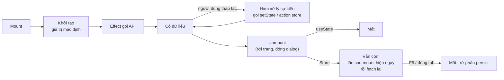

- **Người dùng làm gì đó → đổi state ngay trong hàm xử lý sự kiện.** Không đợi `useEffect` "phát hiện" rồi mới `setState` (React báo lỗi _Calling setState synchronously within an effect_).
- **Effect chỉ dùng để đồng bộ với bên ngoài React**: gọi API lúc mount, đăng ký sự kiện bàn phím / cuộn, hẹn giờ debounce, thu hồi `URL.createObjectURL`.

### 3.3. Các mẫu (pattern) lặp lại, kèm code

#### a. Vỏ + thân có `key`: form luôn mới khi mở

**Vấn đề:** mở dialog sửa phòng 101, gõ dở, đóng, mở phòng 102 → form còn dữ liệu của 101.

```tsx
// Vỏ: chỉ lo đóng / mở. Đóng -> trả null -> thân bị unmount
export default function RoomImageDialog({ roomId, onClose }: Props) {
  if (!roomId) return null;
  // key đổi -> React coi là component KHÁC: huỷ cái cũ, dựng cái mới
  return (
    <DialogBody
      key={roomId}
      roomId={roomId}
      onClose={onClose}
    />
  );
}

function DialogBody({ roomId, onClose }: { roomId: string; onClose: () => void }) {
  const [uploading, setUploading] = useState(false); // luôn bắt đầu từ false
  const [confirmUrl, setConfirmUrl] = useState<string | null>(null);
  // ...
}
```

**Vì sao chạy được:** React nhận diện component theo **vị trí + `key`**. `key` đổi thì component cũ bị unmount (mọi `useState` mất), component mới mount với giá trị khởi tạo. Không cần viết `useEffect(() => reset(), [roomId])`.

Dùng ở: `RoomImageDialog`, `CustomerFormDialog` (`key={id}` hoặc `'create'`), `CustomerDrawer` (`key={`${id}-${version}`}`: tăng `version` để ép tải lại sau khi sửa).

#### b. `requestId`: chống response cũ ghi đè

```ts
let listRequestId = 0; // biến cấp module, dùng chung mọi lần gọi

fetchCustomers: async () => {
  const requestId = ++listRequestId;        // lần gọi này mang số mới nhất
  set({ loading: true });
  try {
    const res = await customerApi.list(get().filters);
    if (requestId !== listRequestId) return; // đã có lần gọi mới hơn -> bỏ kết quả cũ
    set({ customers: res.data, total: res.total });
  } finally {
    if (requestId === listRequestId) set({ loading: false });
  }
},
```

**Vì sao chạy được:** mỗi lần gọi tăng biến đếm. Khi response về, nếu biến đếm đã tăng tiếp (có lần gọi mới hơn) thì response này đã cũ, bỏ qua. `loading` cũng chỉ tắt bởi lần gọi mới nhất.

#### c. Cờ `cancelled` trong effect: bỏ kết quả khi đã rời đi

```tsx
useEffect(() => {
  let cancelled = false;
  Promise.all([
    customerApi.detail(id),
    customerApi.bookings(id),
    customerApi.notes(id),
  ]).then(([d, b, n]) => {
    if (cancelled) return; // ngăn đã đóng / đã đổi khách -> không setState nữa
    setCustomer(d);
    setBookings(b);
    setNotes(n);
  });
  return () => {
    cancelled = true;
  }; // cleanup chạy khi unmount hoặc id đổi
}, [id]);
```

**Khác với `requestId`:** `requestId` sống trong store (dùng chung), cờ `cancelled` sống trong **một lần chạy effect**. Mỗi lần effect chạy lại, lần cũ được đánh dấu huỷ.

#### d. Debounce: đợi ngừng gõ mới gọi API

```tsx
const [text, setText] = useState(filters.search); // hiện NGAY từng phím

useEffect(() => {
  if (text.trim() === filters.search.trim()) return;
  const timer = setTimeout(() => setFilters({ search: text }), 350);
  return () => clearTimeout(timer); // gõ phím mới trước 350ms -> huỷ lần hẹn cũ
}, [text, filters.search, setFilters]);
```

**Vì sao chạy được:** mỗi phím làm `text` đổi → effect chạy lại → cleanup huỷ hẹn giờ trước. Chỉ khi ngừng gõ đủ 350ms, hẹn giờ mới kịp chạy. `setFilters` được gọi trong **callback của hẹn giờ**, không phải trực tiếp trong thân effect, nên không vi phạm quy tắc "không setState trong effect".

#### e. Portal cho menu

```tsx
const [pos, setPos] = useState<{ top: number; left: number } | null>(null);

useLayoutEffect(() => {
  // chạy TRƯỚC khi trình duyệt vẽ -> menu không nháy
  if (!open || !btnRef.current) return;
  const btn = btnRef.current.getBoundingClientRect(); // vị trí nút so với màn hình
  const openUp = window.innerHeight - btn.bottom < 240; // sát đáy thì mở lên trên
  setPos({
    top: openUp ? btn.top - 244 : btn.bottom + 4,
    left: btn.right - MENU_WIDTH,
  });
}, [open]);

return (
  open &&
  createPortal(
    <div
      style={{ position: "fixed", top: pos?.top ?? -9999, left: pos?.left ?? -9999 }}
    >
      …
    </div>,
    document.body, // vẽ ra ngoài thẻ phòng -> không bị overflow-hidden cắt
  )
);
```

**Vì sao cần:** thẻ phòng có `overflow-hidden` (để bo góc ảnh), menu vẽ bên trong sẽ bị cắt. Portal đưa menu ra `document.body` nhưng sự kiện React vẫn nổi bọt về component cha như bình thường. Vì menu `position: fixed` theo màn hình, cuộn trang phải **đóng menu** (xem `RoomActionsMenu`).

> `useLayoutEffect` đo DOM rồi `setPos` là trường hợp hợp lệ hiếm hoi của setState trong effect: vị trí phụ thuộc DOM nên không tính được lúc render.

#### f. Khởi tạo lười (lazy initializer)

```tsx
function readSavedView(): View {
  try {
    return localStorage.getItem("hms.rooms.view") === "list" ? "list" : "grid";
  } catch {
    return "grid";
  } // localStorage có thể bị chặn -> luôn bọc try/catch
}

const [view, setView] = useState<View>(readSavedView); // ✅ truyền HÀM: chỉ chạy lúc mount
const [view2, setView2] = useState<View>(readSavedView()); // ❌ gọi hàm: chạy MỖI lần render
```

**Khác biệt:** với `useState(fn())`, React vẫn chỉ dùng giá trị lần đầu nhưng hàm vẫn bị gọi ở mọi lần render (tốn công vô ích). Với `useState(fn)`, React tự gọi `fn` đúng một lần.

#### g. Component con khai báo ngoài component cha

```tsx
// ❌ SAI: mỗi lần Page render tạo ra một hàm Row MỚI -> React coi là component khác
//    -> unmount + mount lại mọi Row, mất state, mất focus ô input. React báo
//    "Cannot create components during render"
function Page() {
  const Row = ({ name }: { name: string }) => <li>{name}</li>;
  return (
    <ul>
      {names.map((n) => (
        <Row
          key={n}
          name={n}
        />
      ))}
    </ul>
  );
}

// ✅ ĐÚNG: khai báo 1 lần ở cấp ngoài cùng file, cần dữ liệu gì thì truyền props
function Row({ name }: { name: string }) {
  return <li>{name}</li>;
}
function Page() {
  return (
    <ul>
      {names.map((n) => (
        <Row
          key={n}
          name={n}
        />
      ))}
    </ul>
  );
}
```

#### Tóm tắt các pattern

| Mẫu                         | Giải quyết                                              | Dùng ở                                                    |
| --------------------------- | ------------------------------------------------------- | --------------------------------------------------------- |
| Vỏ + thân có `key`          | Form / ngăn luôn mới khi mở hoặc đổi bản ghi            | `RoomImageDialog`, `CustomerFormDialog`, `CustomerDrawer` |
| `requestId`                 | Response cũ ghi đè response mới (trong store)           | `customerStore.fetchCustomers`                            |
| Cờ `cancelled`              | `setState` sau khi đã rời đi (trong effect)             | `CustomerDrawer > DrawerBody`                             |
| Debounce                    | Gọi API theo từng phím                                  | `CustomerToolbar`                                         |
| Portal                      | Menu bị khung cha cắt                                   | `RoomActionsMenu`                                         |
| Khởi tạo lười               | Tính giá trị đầu tốn công mỗi lần render                | `useState(readSavedView)`                                 |
| Số liệu tách khỏi danh sách | Lọc bảng làm ô thống kê đổi số                          | `/rooms/stats`, `/customers/stats`                        |
| Component con ngoài cha     | Mất state, lỗi _Cannot create components during render_ | `FloorSection`, `SelectChip`, `Badge`...                  |

### 3.4. Luồng dữ liệu chuẩn của một trang

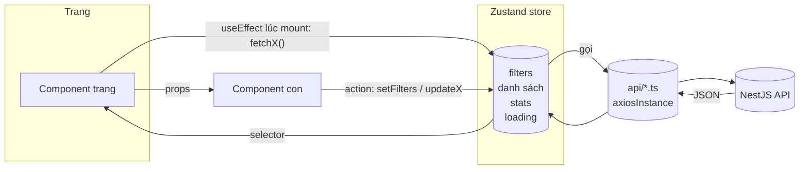

### 3.5. Selector: một field và nhiều field

```tsx
// ✅ Mỗi field một selector: component chỉ render lại khi ĐÚNG field đó đổi
const rooms = useRoomStore((s) => s.rooms);
const loading = useRoomStore((s) => s.loading);

// ❌ Lấy cả store: field nào trong store đổi cũng render lại
const { rooms, loading } = useRoomStore();

// ❌ Trả về object mới trong selector: MỖI lần store đổi (bất kỳ field nào)
//    selector tạo object mới -> so sánh !== -> render lại. Zustand v5 còn báo
//    lỗi vòng lặp vô hạn "getSnapshot should be cached"
const { rooms, loading } = useRoomStore((s) => ({
  rooms: s.rooms,
  loading: s.loading,
}));

// ✅ Cần nhiều field trong một dòng: bọc bằng useShallow
import { useShallow } from "zustand/react/shallow";
const { rooms, loading } = useRoomStore(
  useShallow((s) => ({ rooms: s.rooms, loading: s.loading })), // so sánh từng field bên trong
);
```

**Vì sao `useShallow` chạy được:** Zustand so sánh kết quả selector lần trước và lần này bằng `===`. Object mới luôn khác object cũ. `useShallow` đổi cách so sánh thành "từng field bên trong có `===` nhau không", nên chỉ render lại khi `rooms` hoặc `loading` thật sự đổi.

Code hiện tại chủ yếu dùng **mỗi field một selector**. Một số file cũ còn lấy cả store (`const { ... } = useRoomStore()`), nên dần chuyển sang cách này khi sửa tới.

---

## 4. Hình dạng các store

### 4.1. Store mẫu: `customerStore`

```ts
interface CustomerState {
  // ----- dữ liệu -----
  customers: CustomerListItem[];
  total: number;
  totalPages: number;
  filters: CustomerFilters; // page, limit, search, nationality, membership, stay[], sort, order
  loading: boolean;
  lastUpdated: Date | null; // null = chưa tải lần nào -> hiện "Đang tải" thay vì bảng mờ
  stats: CustomerStats | null;
  // ----- action -----
  fetchCustomers: () => Promise<void>;
  fetchStats: () => Promise<void>;
  setFilters: (patch: Partial<CustomerFilters>) => void;
  resetFilters: () => void;
  refresh: () => Promise<void>;
}
```

Mọi store danh sách trong project theo cùng khuôn: **dữ liệu + `filters` + `loading` + `lastUpdated` + `stats`**, action `fetchX`, `fetchStats`, `setFilters`, và các action ghi (`updateX`, `deleteX`...).

### 4.2. Bảng action

**`customerStore`** (`features/customer/store/customerStore.ts`)

| Action              | Làm gì                                                                          | Tự gọi API                  | Toast | Gọi thêm sau đó                               |
| ------------------- | ------------------------------------------------------------------------------- | --------------------------- | ----- | --------------------------------------------- |
| `fetchCustomers`    | Tải trang hiện tại theo `filters`, có `requestId`                               | Có (`GET /customers`)       | Lỗi   | —                                             |
| `fetchStats`        | Tải 4 số liệu + số trên tab                                                     | Có (`GET /customers/stats`) | Lỗi   | —                                             |
| `setFilters(patch)` | Gộp `patch` vào `filters`. Đổi bất kỳ field nào **ngoài `page`** thì về trang 1 | Không trực tiếp             | Không | **Tự gọi `fetchCustomers()`**                 |
| `resetFilters`      | Về `DEFAULT_FILTERS`                                                            | Không trực tiếp             | Không | `fetchCustomers()`                            |
| `refresh`           | Tải lại cả danh sách và số liệu, dùng sau khi thêm / sửa khách                  | Không trực tiếp             | Không | `fetchCustomers()` + `fetchStats()` song song |

**`room.store`** (`features/<phòng>/stores/room.store.ts`)

| Action                             | Làm gì                                  | Tự gọi API              | Toast | Gọi thêm sau đó                                                            |
| ---------------------------------- | --------------------------------------- | ----------------------- | ----- | -------------------------------------------------------------------------- |
| `fetchRooms`                       | Tải phòng theo `filters` (`limit: 500`) | Có                      | Lỗi   | —                                                                          |
| `fetchStats`                       | Đếm phòng theo trạng thái + theo tầng   | Có (`GET /rooms/stats`) | Lỗi   | —                                                                          |
| `setFilters(patch)`                | Gộp bộ lọc                              | Không trực tiếp         | Không | **Tự gọi `fetchRooms()`** (xem ghi chú)                                    |
| `updateRoomStatus(id, { status })` | Đổi trạng thái                          | Có                      | Lỗi   | <!-- TODO: cần xác nhận từ code: có gọi fetchStats() sau khi đổi không --> |
| `deleteRoom(id)`                   | Ẩn phòng                                | Có                      | Lỗi   | <!-- TODO: cần xác nhận từ code -->                                        |
| `addRoomImages(id, files)`         | Upload ảnh                              | Có                      | Lỗi   | Thay phòng trong `rooms[]`                                                 |
| `updateRoomImages(id, images)`     | Sắp xếp / bớt ảnh                       | Có                      | Lỗi   | Thay phòng trong `rooms[]`                                                 |

**Ai gọi lại API khi bộ lọc đổi?** Cả hai store đều theo cách **store tự gọi**: `setFilters` cập nhật bộ lọc rồi gọi `fetchX()`. Bằng chứng ở trang Phòng: `RoomManagement` chỉ gọi `fetchRooms()` **một lần** lúc mount, còn phân trang chỉ gọi `setFilters({ page })`, không có `useEffect` nào theo dõi `filters`.

<!-- TODO: cần xác nhận từ code: đọc room.store.ts để chắc setFilters tự gọi fetchRooms() -->

Cách "store tự gọi" có lợi: component chỉ việc gọi `setFilters`, không ai quên gọi `fetch`, và không có `useEffect` phụ thuộc vào object `filters` (dễ gây gọi API lặp).

**`authStore`** (`features/auth/store/authStore.ts`): xem [mục 6](#6-đăng-nhập-token-và-phiên-làm-việc).

**`shiftStore`, `myShiftStore`, `profileStore`:** <!-- TODO: cần xác nhận từ code: danh sách state và action của 3 store này --> Xem mục 11, 12 cho phần đã biết.

---

## 5. Loading, lỗi và toast

### 5.1. Loading

| Tình huống                             | Hiện gì                                                              | Đọc cờ nào                                                            |
| -------------------------------------- | -------------------------------------------------------------------- | --------------------------------------------------------------------- |
| Lần tải **đầu tiên** (chưa có dữ liệu) | Chữ "Đang tải danh sách…" thay cho bảng                              | `loading && !lastUpdated`                                             |
| Tải **lại** (đã có dữ liệu cũ)         | `LoadingBar` (thanh mảnh chạy trên đầu bảng) + làm mờ bảng, chặn bấm | `loading` (và `lastUpdated` khác `null`)                              |
| Đang lưu trong dialog                  | Nút đổi thành "Đang lưu", bị khoá                                    | State cục bộ: `saving`, `uploading`, `isSubmitting` (React Hook Form) |

```tsx
<div className="relative">
  <LoadingBar active={loading} />
  <div className={loading && lastUpdated ? 'pointer-events-none opacity-50' : ''}>
    <CustomerTable ... />
  </div>
</div>
```

**Vì sao giữ dữ liệu cũ khi tải lại:** bảng không bị nháy trắng mỗi lần đổi bộ lọc; làm mờ + chặn bấm để người dùng không thao tác trên dữ liệu sắp bị thay.

### 5.2. Lỗi

`utils/errorMessage.ts` export `getErrorMessage(err, fallback)`: lấy câu lỗi từ response của BE (`{ success: false, statusCode, message }`), không có thì dùng `fallback`.

<!-- TODO: cần xác nhận từ code: nội dung getErrorMessage (xử lý lỗi mạng, message là mảng, lỗi không phải axios) -->

BE đã được sửa để `message` luôn là **một câu** (exception filter lấy phần tử đầu nếu ValidationPipe trả mảng), nên FE hiện thẳng câu đó cho người dùng.

### 5.3. Toast

Dùng thư viện **sonner** (`import { toast } from 'sonner'`).

| Loại           | Đặt ở đâu                                 | Vì sao                                                                                            |
| -------------- | ----------------------------------------- | ------------------------------------------------------------------------------------------------- |
| **Lỗi**        | Trong **store** (khối `catch` của action) | Store biết lỗi API xảy ra; component nào gọi cũng được báo, không ai quên                         |
| **Thành công** | Trong **component**                       | Chỉ component biết ngữ cảnh để viết câu cụ thể: "Đã ẩn phòng 203", "Đã thêm khách Trần Minh Khoa" |

```ts
// store: báo lỗi rồi NÉM LẠI để component biết mà không toast thành công
updateRoomStatus: async (id, dto) => {
  try { /* gọi API, cập nhật rooms */ }
  catch (err) { toast.error(getErrorMessage(err, 'Không đổi được trạng thái phòng')); throw err; }
},

// component: chỉ toast khi thành công
try {
  await updateRoomStatus(room.id, { status });
  toast.success(`Phòng ${room.room_number} chuyển sang ${STATUS_LABELS[status].toLowerCase()}`);
} catch { /* store đã báo lỗi */ }
```

Ngoại lệ: dữ liệu **cục bộ** (chi tiết khách, ghi chú, form) không đi qua store, nên component tự toast cả lỗi lẫn thành công.

---

## 6. Đăng nhập, token và phiên làm việc

### 6.1. Token nằm ở đâu

| Thứ                                     | Nằm ở                                                      | F5 còn không                    |
| --------------------------------------- | ---------------------------------------------------------- | ------------------------------- |
| **Access token**                        | Bộ nhớ (`authStore.accessToken`), **không** persist        | Mất, lấy lại bằng refresh token |
| **Refresh token**                       | Cookie do BE đặt (gửi kèm nhờ `withCredentials: true`)     | Còn                             |
| **`user`** (id, email, roles, fullname) | `authStore`, persist vào `localStorage` key `auth-storage` | Còn                             |

**Vì sao không lưu access token vào `localStorage`:** script độc hại chèn vào trang (XSS) đọc được `localStorage`. Access token chỉ nằm trong bộ nhớ, sống ngắn; refresh token nằm trong cookie mà JavaScript không nên đọc được.

<!-- TODO: cần xác nhận từ code BE: cookie refresh token có cờ httpOnly, secure, sameSite không -->

### 6.2. F5 thì sao: `bootstrap()`

`App.tsx` gọi `authStore.bootstrap()` **một lần** khi khởi động:

1. `isInitializing = true` → App chờ, chưa vẽ route (tránh đá về `/login` khi chưa kịp kiểm tra).
2. Gọi refresh (cookie tự gửi kèm) → nhận access token mới → lưu vào store.
3. Gọi `getMe()` → cập nhật `user` (roles, fullname).
4. Lỗi ở bước 2 hoặc 3 → `clearAuth()` → coi như chưa đăng nhập.
5. Luôn đặt `isInitializing = false`.

### 6.3. `authStore`

| Action                                      | Làm gì                                                                                                 |
| ------------------------------------------- | ------------------------------------------------------------------------------------------------------ |
| `login(payload)`                            | Gọi đăng nhập → lưu `user`, `accessToken`, `isAuthenticated`; gọi thêm `getMe()` để có `fullname` ngay |
| `logout()`                                  | Gọi API đăng xuất; **dù lỗi vẫn** `clearAuth()` để người dùng luôn thoát được                          |
| `bootstrap()`                               | Xem 6.2                                                                                                |
| `setAccessToken(token)`                     | Interceptor gọi sau khi refresh thành công                                                             |
| `clearAuth()`                               | Xoá `user`, `accessToken`, `isAuthenticated`                                                           |
| `hasRole(role)`, `isAdmin()`, `isManager()` | Kiểm tra quyền; `isManager()` đúng cả với admin                                                        |

<!-- TODO: cần xác nhận từ code: login() đang set({ user: MeRes }) còn bootstrap() dùng meRes.data và map fullName -> fullname; hai chỗ có thể lệch cấu trúc user -->

### 6.4. `axiosInstance`: gắn token và refresh

<!-- TODO: cần xác nhận từ code: toàn bộ mục này (cách gắn header, xử lý 401, có hàng đợi request khi đang refresh không, refresh thất bại thì điều hướng thế nào) -->

Luồng dự kiến, cần đối chiếu với `api/axiosInstance.ts`:

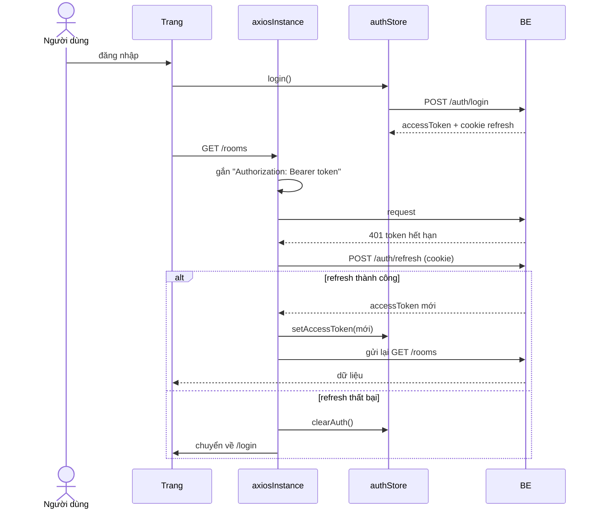

**Điểm cần kiểm tra khi đọc `axiosInstance.ts`:** nếu 3 request cùng dính 401, có gọi refresh 3 lần không? Cách đúng là chỉ refresh **một lần**, các request còn lại xếp hàng chờ token mới rồi gửi lại. Nếu chưa có, đây là việc nên làm.

---

## 7. Bản đồ tổng thể và phân quyền

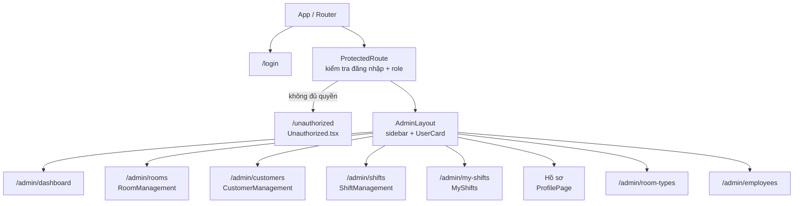

### 7.1. Role × trang

Role theo thứ tự quyền (`ROLE_ORDER`): **admin > manager > staff > customer**. Customer không vào trang quản trị.

| Trang                          | Đường dẫn                                                          | admin | manager |    staff    |
| ------------------------------ | ------------------------------------------------------------------ | :---: | :-----: | :---------: |
| Tổng quan                      | `/admin/dashboard`                                                 |   ✓   |    ✓    |      ✓      |
| Phòng                          | `/admin/rooms`                                                     |   ✓   |    ✓    |      ✓      |
| Khách hàng                     | `/admin/customers`                                                 |   ✓   |    ✓    |      ✓      |
| Đặt phòng, Hoá đơn, Thanh toán | `/admin/bookings`, `/admin/invoices`, `/admin/payments`            |   ✓   |    ✓    |      ✓      |
| Ca làm việc                    | `/admin/shifts`                                                    |   ✓   |    ✓    | ✓ (chỉ xem) |
| Lịch của tôi                   | `/admin/my-shifts`                                                 |   ✓   |    ✓    |      ✓      |
| Hồ sơ                          | <!-- TODO: cần xác nhận từ code: /profile hay /admin/profile -->   |   ✓   |    ✓    |      ✓      |
| Nhân viên                      | `/admin/employees`                                                 |   ✓   |    ✓    |      ✗      |
| Loại phòng                     | `/admin/room-types`                                                |   ✓   |    ✓    |      ✗      |
| Dịch vụ                        | <!-- TODO: cần xác nhận từ code: /services hay /admin/services --> |   ✓   |    ✓    |      ✗      |

<!-- TODO: cần xác nhận từ code: bảng trên lấy từ mảng NAV của AdminLayout bản cũ; đối chiếu lại với AdminLayout sau PR theme và cấu hình route -->

**Trong trang còn có quyền chi tiết hơn**, BE kiểm tra, FE ẩn nút cho gọn:

- Staff không sửa được điểm thưởng, không khoá tài khoản khách (form khách chỉ hiện ô này khi `roles` có manager / admin).
- Staff xem được lịch trực nhưng không xếp ca.
- Chỉ manager / admin thêm phòng, sửa ảnh phòng.

### 7.2. ⚠ Luật phân quyền đang nằm ở hai nơi

| Nơi                                                   | Tác dụng                       |
| ----------------------------------------------------- | ------------------------------ |
| Mảng `NAV` trong `AdminLayout` (`roles` của từng mục) | **Ẩn / hiện** mục menu         |
| Cấu hình route với `ProtectedRoute`                   | **Chặn thật** khi gõ thẳng URL |

Sửa một nơi mà quên nơi kia sẽ ra hai lỗi ngược nhau: menu hiện nhưng bấm vào bị 403, hoặc menu ẩn nhưng gõ URL vẫn vào được. **Luôn sửa cả hai cùng lúc.** Việc nên làm sau: gom về một mảng cấu hình duy nhất (đường dẫn, role, nhãn, icon) rồi cả menu lẫn router đều đọc từ đó.

---

## 8. Khung trang

### 8.1. Vị trí trên màn hình

```
┌──────────────┬───────────────────────────────────────────────┐
│ Aurélien     │                                               │
│ Hotel        │                                               │
│ VẬN HÀNH     │                                               │
│ ▣ Tổng quan  │            <Outlet /> = trang hiện tại        │
│ ▣ Phòng  ◄── │                                               │
│ ▣ Khách hàng │                                               │
│ QUẢN TRỊ     │                                               │
│ ▣ Nhân viên  │                                               │
│ ┌──────────┐ │                                               │
│ │ UserCard │ │                                               │
│ └──────────┘ │                                               │
└──────────────┴───────────────────────────────────────────────┘
   AdminLayout
```

### 8.2. Component

| Component                      | Làm gì                                                                                                    | Props chính                   | Store                             |
| ------------------------------ | --------------------------------------------------------------------------------------------------------- | ----------------------------- | --------------------------------- |
| `AdminLayout`                  | Sidebar navy + vùng nội dung. Menu 2 nhóm "Vận hành" / "Quản trị", lọc theo role. Mục đang mở có nền vàng | `children` hoặc `<Outlet />`  | `useAuthStore` (user, logout)     |
| `UserCard` (trong AdminLayout) | Avatar, tên, vai trò, dòng "đang trong ca chiều", nút đăng xuất. Bấm thẻ → Hồ sơ                          | —                             | `useAuthStore`, `useMyShiftStore` |
| `ProtectedRoute`               | Chưa đăng nhập → `/login`. Thiếu role → `<Navigate to="/unauthorized" replace state={{ from, roles }} />` | `roles` được phép, `children` | `useAuthStore`                    |
| `Unauthorized`                 | Trang 403 kiểu biển số phòng; nói rõ "trang X cần role Y"; nút về trang chủ phù hợp role                  | —                             | `useLocation().state`             |

- `replace` trong `Navigate`: bấm Back không quay lại trang bị chặn (tránh vòng lặp).
- Vai trò hiển thị = role cao nhất: `ROLE_ORDER.find((r) => user.roles.includes(r))`.

---

## 9. Trang Phòng

### 9.1. Vị trí trên màn hình

```
┌────────────────────────────────────────────────────────────────────┐
│ VẬN HÀNH                          [Phòng trống theo ngày] [+ Thêm phòng]
│ Phòng                                                              │ ← RoomManagement
│ 28 phòng đang hoạt động, cập nhật lúc 20:27                        │
├────────────────────────────────────────────────────────────────────┤
│ ┌Trống──┐ ┌Có khách┐ ┌Đang dọn┐ ┌Bảo trì┐                          │ ← RoomStatsCards
├────────────────────────────────────────────────────────────────────┤
│ [Tất cả][Trống][Có khách]...   Sắp xếp  Loại phòng  Tìm số phòng   │ ← RoomToolbar
│ [Tất cả tầng 28][Tầng 1 6][Tầng 2 6]...                            │ ← FloorBar
│ ════ LoadingBar ═══════════════════════════════════════════════    │
│ Tầng 1   6 phòng, 2 trống ─────────────────────────────── [⌃]      │ ← RoomGrid > FloorSection
│ ┌RoomCard┐ ┌RoomCard┐ ┌RoomCard┐ ...                               │
│ │ ảnh  ⋯ │ │        │ │        │     ⋯ = RoomActionsMenu           │
│ └────────┘ └────────┘ └────────┘                                   │
└────────────────────────────────────────────────────────────────────┘
  + RoomForm  + RoomImageDialog  + AvailabilityDialog  (dialog)
```

### 9.2. Cây component

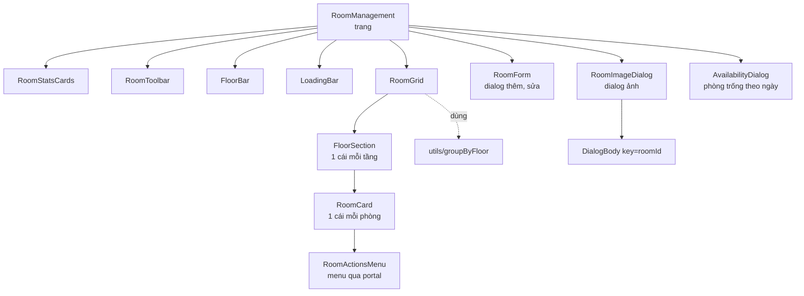

### 9.3. Từng component

| Component                        | Viết ra để                                                                               | Props chính                                   | Store                                                              |
| -------------------------------- | ---------------------------------------------------------------------------------------- | --------------------------------------------- | ------------------------------------------------------------------ |
| `RoomManagement`                 | Ráp trang; giữ tầng đang chọn, dialog đang mở; gọi `fetchRooms` + `fetchStats` lúc mount | —                                             | Đọc `rooms, total, stats, loading, lastUpdated`                    |
| `RoomStatsCards`                 | 4 ô số liệu toàn khách sạn; bấm = lọc trạng thái, bấm lại = bỏ lọc                       | —                                             | Đọc `stats, filters.status`; ghi `setFilters({ status, page: 1 })` |
| `RoomToolbar`                    | Tab trạng thái, sắp xếp, loại phòng, tìm số phòng                                        | —                                             | Đọc `filters`; ghi `setFilters`                                    |
| `FloorBar`                       | Chip từng tầng: tổng phòng, thanh tỉ lệ trạng thái, số phòng trống                       | `floors, selected, onSelect`                  | —                                                                  |
| `RoomGrid`                       | Gom phòng theo tầng, vẽ `FloorSection`, trạng thái rỗng                                  | `rooms, onEdit, onManageImages`               | —                                                                  |
| `FloorSection`                   | Tiêu đề tầng + nút thu gọn + lưới thẻ                                                    | `floor, rooms, collapsed, onToggle, children` | —                                                                  |
| `RoomCard`                       | Ảnh bìa (bấm → ảnh), nhãn trạng thái, thân thẻ (bấm → sửa), giá                          | `room, onEdit, onManageImages`                | —                                                                  |
| `RoomActionsMenu`                | Menu `⋯`: sửa, ảnh, chuyển trạng thái hợp lệ, ẩn phòng (có xác nhận)                     | `room, onEdit, onManageImages, variant`       | Ghi `updateRoomStatus`, `deleteRoom`                               |
| `RoomForm`                       | Dialog thêm / sửa phòng                                                                  | `open, onClose, room`                         | Ghi action tạo / sửa                                               |
| `RoomImageDialog` → `DialogBody` | Thêm ảnh (kéo thả / chọn), kéo sắp xếp, đặt bìa, xoá                                     | `roomId, onClose`                             | Đọc `rooms.find(id)`; ghi `addRoomImages`, `updateRoomImages`      |
| `AvailabilityDialog`             | Tìm phòng trống theo khoảng ngày (`GET /rooms/available`)                                | `open, onClose`                               | —                                                                  |

`RoomCard` có 3 vùng bấm riêng (ảnh, thân, `⋯`) thay vì cả thẻ là 1 nút: nút lồng trong nút là HTML sai, bàn phím và trình đọc màn hình bị lỗi.

### 9.4. State: ở đâu, sống bao lâu

| State                                                      | Nằm ở                          | Khởi tạo                        | Đổi khi                                                                 | Mất khi                   |
| ---------------------------------------------------------- | ------------------------------ | ------------------------------- | ----------------------------------------------------------------------- | ------------------------- |
| `rooms`, `total`                                           | `room.store`                   | `[]` → `fetchRooms()` lúc mount | Đổi bộ lọc, sau khi sửa / đổi trạng thái / thêm ảnh                     | F5                        |
| `stats` (kèm `floors`)                                     | `room.store`                   | `null` → `fetchStats()`         | Sau thao tác đổi trạng thái / ẩn phòng                                  | F5                        |
| `filters` (status, sort, loại phòng, search, `limit: 500`) | `room.store`                   | Mặc định                        | `setFilters` từ Toolbar / StatsCards                                    | F5 (giữ khi chuyển trang) |
| `loading`, `lastUpdated`                                   | `room.store`                   | `false`, `null`                 | Mỗi lần fetch                                                           | F5                        |
| `floor`                                                    | `RoomManagement`               | `'all'`                         | Bấm chip ở `FloorBar`                                                   | Rời trang                 |
| `activeFloor`                                              | **Suy ra**                     | —                               | Mỗi render: tầng đang chọn không còn trong `stats.floors` → `'all'`     | —                         |
| `visibleRooms`                                             | **Suy ra** (`useMemo`)         | —                               | `rooms` hoặc `activeFloor` đổi                                          | —                         |
| `formOpen, editTarget, imageRoomId, availabilityOpen`      | `RoomManagement`               | đóng / `null`                   | Bấm nút / thẻ                                                           | Rời trang                 |
| `collapsed: Set<number>`                                   | `RoomGrid`                     | `new Set()`                     | Bấm thu gọn; luôn tạo **Set mới** (sửa Set cũ thì React không thấy đổi) | Rời trang                 |
| `open, confirming, pos`                                    | `RoomActionsMenu`              | đóng                            | Bấm `⋯`; đóng khi bấm ra ngoài / Esc / cuộn / đổi kích thước            | Menu đóng                 |
| `uploading, saving, dragIndex, confirmUrl...`              | `RoomImageDialog > DialogBody` | mặc định                        | Thao tác trong dialog                                                   | Đóng dialog / đổi phòng   |

**Vì sao lọc tầng ở FE, lọc trạng thái ở BE?** Trang tải đủ phòng một lần (`limit: 500`), đổi tầng chỉ cần lọc mảng có sẵn. Số liệu tầng lấy từ `stats.floors` (toàn khách sạn) nên chip tầng **không đổi** khi lọc trạng thái.

**Vì sao `activeFloor` là suy ra, không dùng `useEffect` + `setFloor('all')`?** Ẩn phòng cuối cùng của tầng 5 → tầng 5 biến mất khỏi `stats.floors`. Dùng effect thì có 1 lần render sai (lưới trống) rồi mới render lại. Tính thẳng khi render thì không bao giờ sai:

```tsx
const activeFloor: FloorValue =
  floor !== "all" && stats && !floors.some((f) => f.floor === floor) ? "all" : floor;
```

### 9.5. Luật chuyển trạng thái phòng

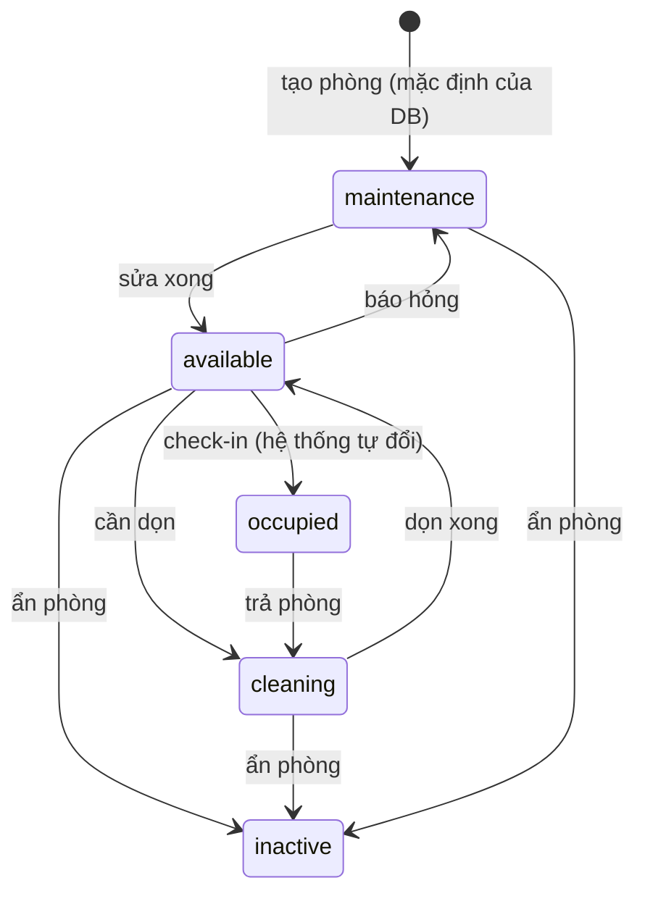

- Người dùng **không** tự chuyển sang "Có khách" được; chỉ quy trình check-in (trang Đặt phòng) làm việc đó.
- "Có khách" không về thẳng "Trống", phải qua "Đang dọn".
- Không ẩn được phòng đang có khách hoặc còn booking chưa kết thúc (BE kiểm tra).
- Phòng mới tạo ở trạng thái **Bảo trì** (mặc định trong schema Prisma), phải chuyển sang Trống để bắt đầu bán.

> ⚠ Luật này nằm ở **hai nơi**: FE `VALID_TRANSITIONS` trong `types/room.ts` (quyết định menu hiện lựa chọn nào) và BE `VALID_TRANSITIONS` trong `room.service.ts` (chặn thật). **Sửa cả hai.**

<!-- TODO: cần xác nhận từ code: nội dung VALID_TRANSITIONS phía FE có khớp BE không; phòng mới tạo có đang để mặc định maintenance không -->

### 9.6. Kịch bản: đổi trạng thái 1 phòng

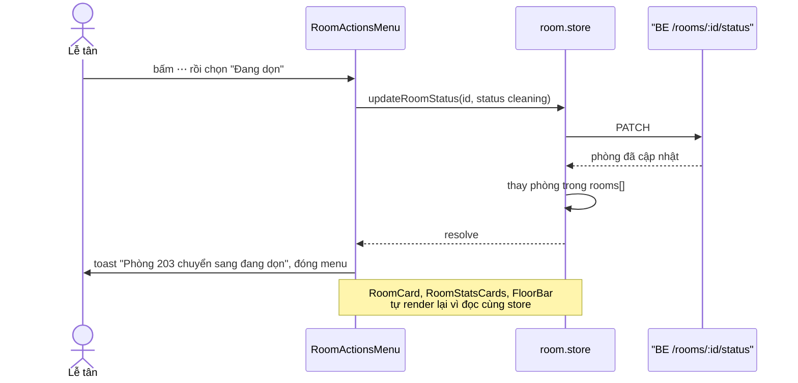

### 9.7. Kịch bản: thêm ảnh phòng

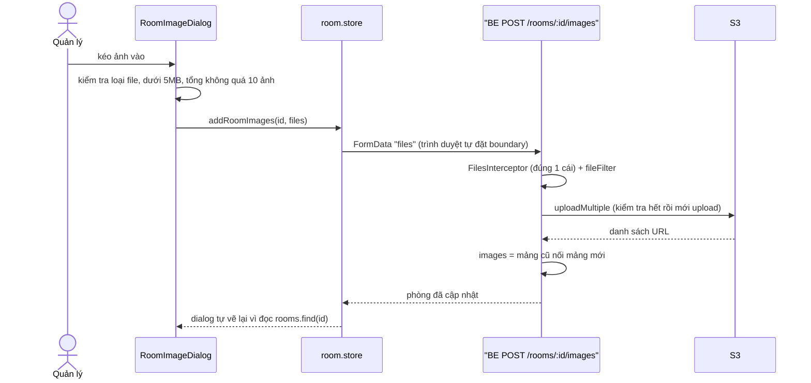

---

## 10. Trang Khách hàng

### 10.1. Vị trí trên màn hình

```
┌──────────────────────────────────────────────────────────┐  ┌───────────────────────┐
│ QUẢN LÝ KHÁCH                            [+ Thêm khách]  │  │ CustomerDrawer        │
│ Khách hàng                                               │  │ (trượt ra khi bấm 1   │
│ 248 khách, 31 thành viên, cập nhật lúc 21:13             │  │  dòng, đè mép phải)   │
├──────────────────────────────────────────────────────────┤  │ ┌───────────────────┐ │
│ [Đang lưu trú][Sắp đến][Khách mới][Tỉ lệ quay lại]       │  │ │ TK Trần Minh Khoa │ │
├──────────────────────────────────────────────────────────┤  │ │ [Sửa] [✕]         │ │
│ [🔍 Tìm theo tên, SĐT...        /] [Tất cả|Vãng lai|TV]  │  │ ├──────┬──────┬─────┤ │
│ Lưu trú:[Đang ở][Sắp đến][Không]  Quốc tịch▾  Sắp xếp▾   │  │ │Số lần│Tổng  │Điểm │ │
├──────────────────────────────────────────────────────────┤  │ ├──────┴──────┴─────┤ │
│ KHÁCH        GIẤY TỜ   LẦN Ở GẦN NHẤT  SỐ LẦN  LƯU TRÚ   │  │ │Hồ sơ|Đặt phòng|GC │ │
│ TK Trần Minh Khoa ...                                    │  │ └───────────────────┘ │
├──────────────────────────────────────────────────────────┤  └───────────────────────┘
│ Trang 1 trên 13                  [Trước][1][2]…[13][Sau] │
└──────────────────────────────────────────────────────────┘
          + CustomerFormDialog (giữa màn hình, nền mờ)
```

### 10.2. Cây component

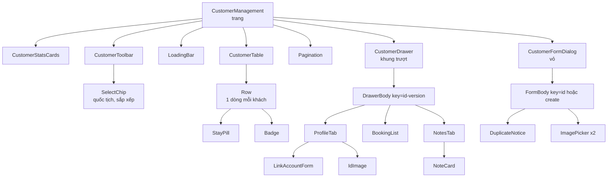

### 10.3. Từng component

| Component                         | Viết ra để                                                                                              | Props chính                                       | Store                                                                                                     |
| --------------------------------- | ------------------------------------------------------------------------------------------------------- | ------------------------------------------------- | --------------------------------------------------------------------------------------------------------- |
| `CustomerManagement`              | Ráp trang; giữ khách đang mở hồ sơ, form đang mở; mount → `refresh()`                                   | —                                                 | Đọc `stats, total, totalPages, filters.page, loading, lastUpdated`; ghi `setFilters({ page })`, `refresh` |
| `CustomerStatsCards`              | 4 ô số liệu; "Đang lưu trú", "Sắp đến" bấm được = lọc                                                   | —                                                 | Đọc `stats, filters.stay`; ghi `setFilters({ stay })`                                                     |
| `CustomerToolbar`                 | Ô tìm (debounce 350ms, phím `/`), tab loại khách, lọc lưu trú (chọn nhiều), quốc tịch, sắp xếp, xoá lọc | —                                                 | Đọc `filters, stats, total, customers.length`; ghi `setFilters`, `resetFilters`                           |
| `SelectChip`                      | Ô chọn dạng chip: `<select>` gốc trong suốt phủ lên trên để giữ bàn phím / trình đọc màn hình           | `label, value, options, onChange`                 | —                                                                                                         |
| `CustomerTable`                   | Bảng CSS grid; màn hẹp cuộn ngang (`min-w-[940px]`) thay vì bóp chữ                                     | `selectedId, onSelect`                            | Đọc `customers, loading, lastUpdated`                                                                     |
| `Row`                             | 1 dòng: avatar, tên, SĐT + nhãn, giấy tờ 4 số cuối, lần ở gần nhất, số lần, lưu trú                     | `customer, selected, onSelect`                    | —                                                                                                         |
| `StayPill`                        | "Đang ở · 302" / "Sắp đến · 02/10" / "Không lưu trú". **Export** để ngăn hồ sơ dùng lại                 | `customer`                                        | —                                                                                                         |
| `Pagination`                      | `1 … 4 5 6 … 42`                                                                                        | `page, totalPages, onChange, disabled`            | —                                                                                                         |
| `CustomerDrawer`                  | Khung trượt, **luôn render** để có hiệu ứng trượt; Esc để đóng                                          | `customerId, version, onClose, onEdit, onChanged` | —                                                                                                         |
| `DrawerBody`                      | Tải song song chi tiết + booking + ghi chú; header, 3 số liệu, 3 tab                                    | `customerId, onClose, onEdit, onChanged`          | Không (cục bộ)                                                                                            |
| `ProfileTab`                      | Thông tin, giấy tờ che / hiện, ảnh giấy tờ, ghi chú mới nhất, 3 booking gần nhất                        | `customer, bookings, notes, onShowTab, onLinked`  | —                                                                                                         |
| `LinkAccountForm`                 | Tạo tài khoản thành viên cho khách vãng lai                                                             | `customer, onLinked`                              | —                                                                                                         |
| `BookingList`                     | Danh sách booking; `compact` cho bản rút gọn                                                            | `bookings, compact`                               | —                                                                                                         |
| `NotesTab`                        | Thêm ghi chú (tối đa 500 ký tự), xoá có xác nhận                                                        | `customerId, notes, onChange`                     | —                                                                                                         |
| `CustomerFormDialog` → `FormBody` | Thêm / sửa khách: React Hook Form + Zod, kiểm tra trùng, ảnh giấy tờ, ô dành cho quản lý                | `target, onClose, onSaved, onOpenExisting`        | Đọc `useAuthStore` (role)                                                                                 |
| `DuplicateNotice`                 | Cảnh báo trùng: vàng (trùng SĐT, cho "Vẫn tạo"), đỏ (trùng giấy tờ, chặn)                               | `tone, title, matches, onOpen, extra`             | —                                                                                                         |
| `ImagePicker`                     | Chọn 1 ảnh, xem trước bằng `URL.createObjectURL`                                                        | `label, file, existingUrl, onChange`              | —                                                                                                         |

### 10.4. State: ở đâu, sống bao lâu

| State                                          | Nằm ở                        | Khởi tạo                                             | Đổi khi                                                                            | Mất khi               |
| ---------------------------------------------- | ---------------------------- | ---------------------------------------------------- | ---------------------------------------------------------------------------------- | --------------------- |
| `customers, total, totalPages`                 | `customerStore`              | `[]`, 0                                              | Mỗi `fetchCustomers()` (có `requestId`)                                            | F5                    |
| `filters`                                      | `customerStore`              | `DEFAULT_FILTERS` (trang 1, 20/trang, mới tạo trước) | `setFilters(patch)`: tự về trang 1 nếu đổi thứ khác `page`, rồi tự fetch           | F5                    |
| `stats`                                        | `customerStore`              | `null`                                               | Mount và sau khi lưu                                                               | F5                    |
| `text` (ô tìm)                                 | `CustomerToolbar`            | `filters.search`                                     | Mỗi phím; sau 350ms → `filters.search`                                             | Rời trang             |
| `selectedId`                                   | `CustomerManagement`         | `null`                                               | Bấm dòng; mở hồ sơ trùng; sau khi lưu                                              | Đóng ngăn / rời trang |
| `drawerVersion`                                | `CustomerManagement`         | `0`                                                  | +1 sau khi **sửa** → `key` của `DrawerBody` đổi → tải lại                          | Rời trang             |
| `formTarget`                                   | `CustomerManagement`         | `null`                                               | `{ mode: 'create' }` / `{ mode: 'edit', customer }`                                | Lưu xong / huỷ        |
| `customer, bookings, notes, error, tab`        | `DrawerBody`                 | `null`, `[]`, `'profile'`                            | Tải xong; thêm / xoá ghi chú sửa `notes` tại chỗ                                   | Đổi khách / đóng ngăn |
| `showId`                                       | `ProfileTab`                 | `false`                                              | Bấm biểu tượng mắt                                                                 | Đổi tab               |
| Giá trị form                                   | `FormBody` (React Hook Form) | `defaultValues` từ khách đang sửa                    | Người dùng gõ                                                                      | Đóng form             |
| `phoneMatches, idMatches, allowDuplicatePhone` | `FormBody`                   | `[]`, `false`                                        | Rời ô SĐT / giấy tờ → `/customers/lookup`; đổi SĐT → `allowDuplicatePhone = false` | Đóng form             |
| `front, back`                                  | `FormBody`                   | `null`                                               | Chọn ảnh                                                                           | Đóng form             |
| `preview`                                      | `ImagePicker`                | `null`                                               | Tạo **trong hàm chọn file**; effect chỉ thu hồi URL cũ                             | Đóng form             |

**Vì sao chi tiết khách không nằm trong store?** Chỉ ngăn hồ sơ dùng. Để cục bộ thì đóng ngăn là tự dọn, đổi khách là tự tải lại nhờ `key`, không cần action `clearDetail`.

**Vì sao phân trang ở BE (khác trang Phòng)?** Khách hàng có thể lên hàng nghìn; phòng chỉ vài chục.

**Kiểm tra trùng không dùng `ref` đếm lượt** mà so với giá trị hiện tại trong ô: `if (normalize(getValues(field)) !== value) return;`. Đọc `ref.current` trong hàm được truyền vào `register()` lúc render bị ESLint `react-hooks` báo lỗi.

### 10.5. Kịch bản: gõ tìm kiếm

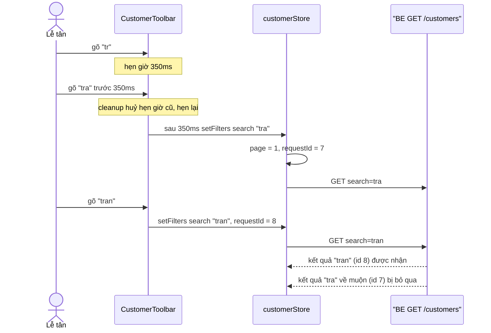

### 10.6. Kịch bản: thêm khách bị trùng số điện thoại

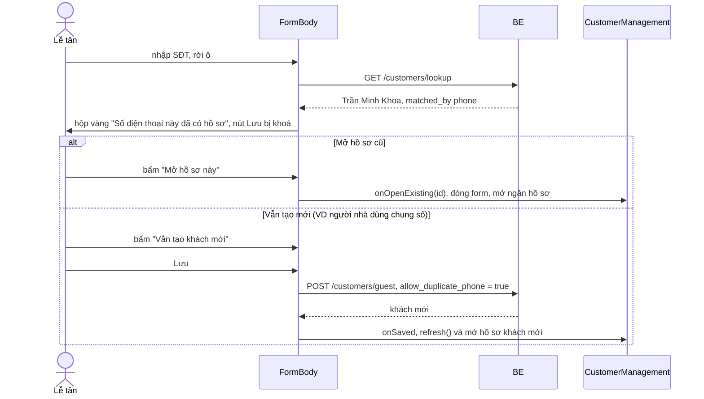

---

## 11. Trang Ca làm việc và Lịch của tôi

### 11.1. Vị trí trên màn hình (Ca làm việc)

```
┌───────────────────────────────────────────────────────────────┐
│ Ca làm việc                                   [Danh mục ca]   │
│ ‹ Tuần 22/09 – 28/09 ›  [Hôm nay]  [Theo ca | Theo nhân viên] │ ← WeekNavigator
│ Thiếu người: T5 sáng 1/2 ...                                  │ ← ShiftTally
├───────────────────────────────────────────────────────────────┤
│         T2      T3      T4  ...                               │
│ Sáng   [chip][chip] [+]  ...                                  │ ← ShiftGrid > ShiftSlot > EmployeeChip
│ Chiều  ...                                                    │   (hoặc StaffGrid khi xem theo nhân viên)
│ Đêm    ...                                                    │
└───────────────────────────────────────────────────────────────┘
   + AssignDialog (xếp người vào 1 ô)   + ShiftCatalogDialog (sửa giờ ca)
```

### 11.2. Cây component

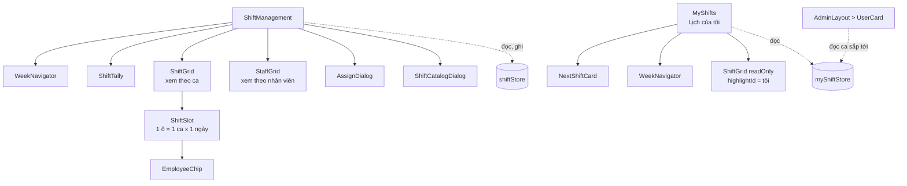

**Tái sử dụng:** `ShiftGrid`, `ShiftSlot`, `WeekNavigator` dùng cho **cả hai trang**:

- Trang quản lý: truyền `onAdd` / `onRemove` → ô có nút thêm / xoá người.
- Lịch của tôi: `readOnly` + `highlightId` → chỉ xem, tô nổi ca của mình.
- `WeekNavigator` nhận `view` (tuỳ chọn) và `children` → trang nào cần nút chuyển kiểu xem thì truyền vào.

```tsx
// Cùng một component, hai cách dùng
<ShiftGrid items={items} onAdd={openAssign} onRemove={removeAssignment} />   // quản lý
<ShiftGrid items={items} readOnly highlightId={me.employeeId} />              // xem lịch của tôi
```

<!-- TODO: cần xác nhận từ code: tên prop dữ liệu của ShiftGrid (items / schedule / cells) và tên các handler -->

### 11.3. Từng component

| Component            | Viết ra để                                                                              | Props chính                                                                             | Store             |
| -------------------- | --------------------------------------------------------------------------------------- | --------------------------------------------------------------------------------------- | ----------------- |
| `ShiftManagement`    | Ráp trang quản lý lịch trực tuần                                                        | —                                                                                       | `shiftStore`      |
| `WeekNavigator`      | Lùi / tiến tuần, về tuần này, (tuỳ chọn) chuyển kiểu xem                                | `view?`, `children?` <!-- TODO: cần xác nhận từ code: prop tuần và handler đổi tuần --> | —                 |
| `ShiftTally`         | Đếm người mỗi ô so với `SHIFT_REQUIRED` (sáng 2, chiều 2, tối 1, đêm 1), cảnh báo thiếu | <!-- TODO: cần xác nhận từ code -->                                                     | —                 |
| `ShiftGrid`          | Lưới ca × ngày                                                                          | `readOnly?`, `highlightId?`, `onAdd?`, `onRemove?`                                      | —                 |
| `ShiftSlot`          | 1 ô: danh sách `EmployeeChip`, nút thêm nếu có `onAdd`                                  | `onAdd?`, `onRemove?`, `highlightId?`                                                   | —                 |
| `EmployeeChip`       | Viên tên nhân viên                                                                      | `highlight?`                                                                            | —                 |
| `StaffGrid`          | Lưới nhân viên × ngày; cột "Số ca" đỏ khi vượt `MAX_SHIFTS_PER_WEEK = 5`                | <!-- TODO: cần xác nhận từ code -->                                                     | —                 |
| `AssignDialog`       | Chọn nhân viên cho 1 ô                                                                  | <!-- TODO: cần xác nhận từ code -->                                                     | Ghi action xếp ca |
| `ShiftCatalogDialog` | Sửa giờ bắt đầu / kết thúc các ca                                                       | <!-- TODO: cần xác nhận từ code -->                                                     | Ghi action sửa ca |
| `MyShifts`           | Lịch cá nhân: thẻ ca sắp tới + lưới chỉ xem                                             | —                                                                                       | `myShiftStore`    |
| `NextShiftCard`      | "Đang trong ca" / "Ca tiếp theo sau 3 giờ" từ `GET /employees/profile/next-shift`       | <!-- TODO: cần xác nhận từ code -->                                                     | `myShiftStore`    |

### 11.4. State: ở đâu, sống bao lâu

| State                                  | Nằm ở                                                                              | Khởi tạo                                           | Đổi khi                                                           | Mất khi     |
| -------------------------------------- | ---------------------------------------------------------------------------------- | -------------------------------------------------- | ----------------------------------------------------------------- | ----------- |
| Danh sách phân công của tuần           | `shiftStore`                                                                       | Tải tuần hiện tại lúc mount (BE mặc định tuần này) | Đổi tuần, sau khi xếp / bỏ ca                                     | F5          |
| Danh mục ca (sáng, chiều, đêm + giờ)   | `shiftStore`                                                                       | Tải lúc mount                                      | Sau khi sửa trong `ShiftCatalogDialog`                            | F5          |
| Tuần đang xem                          | <!-- TODO: cần xác nhận từ code: shiftStore hay useState trong ShiftManagement --> | Tuần chứa hôm nay                                  | Bấm ‹ › / "Hôm nay"                                               | —           |
| Kiểu xem (theo ca / theo nhân viên)    | <!-- TODO: cần xác nhận từ code -->                                                | Theo ca                                            | Bấm nút chuyển                                                    | —           |
| Ô đang mở `AssignDialog`               | `ShiftManagement` (`useState`) <!-- TODO: cần xác nhận từ code -->                 | `null`                                             | Bấm `+` ở một ô                                                   | Đóng dialog |
| Ca sắp tới của tôi                     | `myShiftStore`                                                                     | Tải lúc `UserCard` / `MyShifts` mount              | <!-- TODO: cần xác nhận từ code: có tự tải lại theo giờ không --> | F5          |
| Lịch tuần của tôi                      | `myShiftStore`                                                                     | Tải lúc `MyShifts` mount                           | Đổi tuần                                                          | F5          |
| Ô đếm thiếu người, hàng theo nhân viên | **Suy ra** (hàm thuần + `useMemo`)                                                 | —                                                  | Danh sách phân công đổi                                           | —           |

### 11.5. Dữ liệu suy ra (hàm thuần trong `utils/`)

| Hàm                                           | File                | Từ → Ra                                                             |
| --------------------------------------------- | ------------------- | ------------------------------------------------------------------- |
| `groupByCell`                                 | `utils/schedule.ts` | danh sách phân công → map `ngày + ca` → nhân viên (cho `ShiftGrid`) |
| `computeTally`                                | `utils/schedule.ts` | map ô → số người / số cần, ô thiếu (cho `ShiftTally`)               |
| `buildStaffRows`                              | `utils/schedule.ts` | danh sách phân công → hàng theo nhân viên (cho `StaffGrid`)         |
| `initialsOf`                                  | `utils/schedule.ts` | tên → chữ viết tắt cho avatar                                       |
| tuần, ngày                                    | `utils/week.ts`     | ngày → thứ 2 của tuần, 7 ngày trong tuần                            |
| `formatDuration`, `shiftHours`, `relativeDay` | `utils/time.ts`     | giờ ca → "8 giờ", "ngày mai"...                                     |

**Quy ước giờ:** cột `@db.Time` đọc / ghi theo UTC (`1970-01-01T06:00:00Z`, đọc bằng `toISOString().slice(11, 16)`); "hôm nay" tính theo `Asia/Ho_Chi_Minh`. Ca đêm 22:00 → 06:00 thuộc **ngày bắt đầu**.

### 11.6. Kịch bản: xếp ca bị BE từ chối

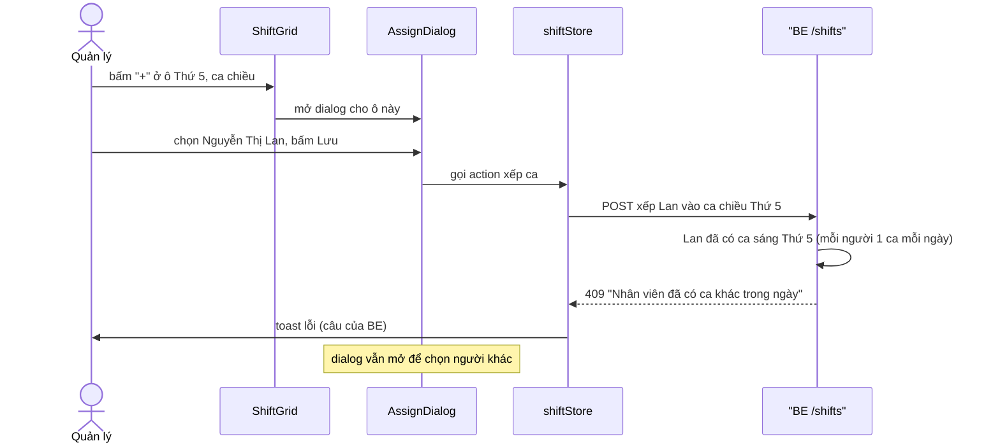

BE còn chặn: xếp vào **ngày đã qua**, xếp **nhân viên bị khoá**. FE chỉ hiện đúng câu lỗi BE trả về.

<!-- TODO: cần xác nhận từ code: tên action xếp ca trong shiftStore, dialog có tự đóng khi lỗi không -->

---

## 12. Trang Hồ sơ

### 12.1. Cây component

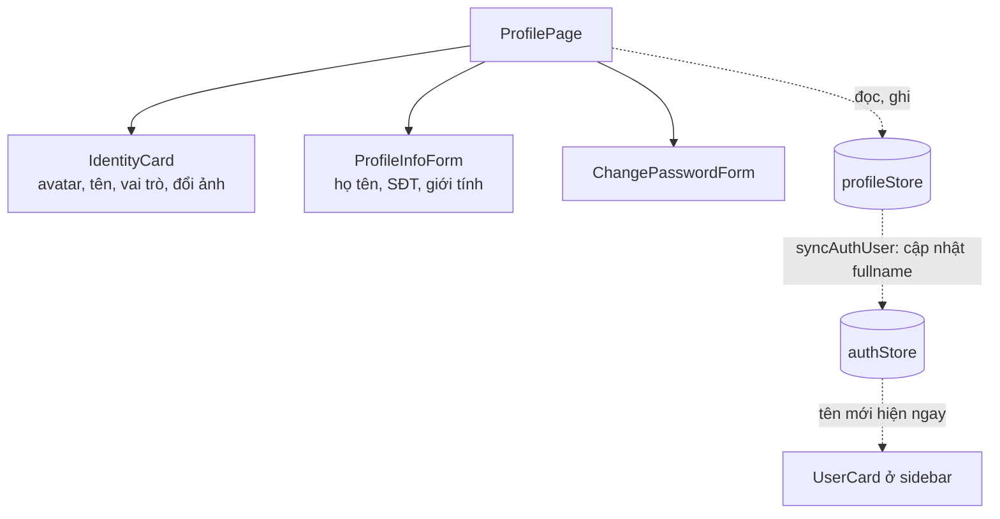

### 12.2. Từng component

| Component            | Viết ra để                                                                 | Props chính                         | Store                                                                       |
| -------------------- | -------------------------------------------------------------------------- | ----------------------------------- | --------------------------------------------------------------------------- |
| `ProfilePage`        | Ráp trang, tải hồ sơ lúc mount                                             | —                                   | `profileStore`                                                              |
| `IdentityCard`       | Avatar, tên, vai trò; đổi ảnh (dưới 5MB, gửi `multipart/form-data`)        | <!-- TODO: cần xác nhận từ code --> | `profileStore`                                                              |
| `ProfileInfoForm`    | Sửa thông tin cá nhân. **Export** `Field` và `INPUT` để form khác dùng lại | <!-- TODO: cần xác nhận từ code --> | `profileStore`                                                              |
| `ChangePasswordForm` | Mật khẩu hiện tại + mới (8–72 ký tự, có chữ và số)                         | —                                   | <!-- TODO: cần xác nhận từ code: gọi store hay gọi profileApi trực tiếp --> |

Giới hạn 72 ký tự vì bcrypt (thuật toán băm mật khẩu ở BE) chỉ dùng 72 byte đầu; dài hơn thì phần thừa bị bỏ qua âm thầm.

### 12.3. State: ở đâu, sống bao lâu

| State                             | Nằm ở                 | Khởi tạo                    | Đổi khi                                            | Mất khi   |
| --------------------------------- | --------------------- | --------------------------- | -------------------------------------------------- | --------- |
| Hồ sơ của tôi                     | `profileStore`        | Tải lúc `ProfilePage` mount | Sau khi lưu thông tin / đổi ảnh                    | F5        |
| `fullname` trong `authStore.user` | `authStore` (persist) | Từ `getMe()`                | `syncAuthUser` sau khi lưu tên                     | Đăng xuất |
| Giá trị form thông tin            | `ProfileInfoForm`     | Từ hồ sơ                    | Người dùng gõ; "Hoàn tác" về giá trị ban đầu       | Rời trang |
| Giá trị form mật khẩu             | `ChangePasswordForm`  | Rỗng                        | Người dùng gõ; **xoá sạch** sau khi đổi thành công | Rời trang |

**Hai store nói chuyện với nhau:** sửa tên xong, `profileStore` gọi `syncAuthUser` để cập nhật `fullname` trong `authStore` → `UserCard` ở sidebar đổi tên ngay, không cần tải lại trang. Giao tiếp đi qua **action của store**, không qua component.

### 12.4. Kịch bản: đổi mật khẩu

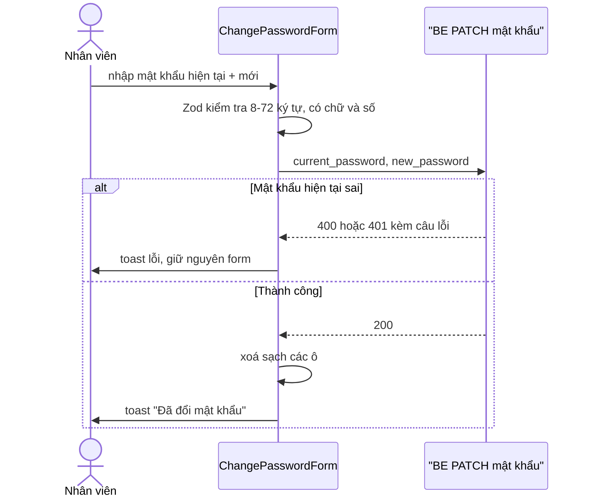

<!-- TODO: cần xác nhận từ code: đường dẫn API đổi mật khẩu, mã lỗi BE trả khi sai mật khẩu hiện tại, có đăng xuất các phiên khác sau khi đổi không -->

---

## 13. Các trang khác

| Trang                          | Trạng thái tài liệu                                                                                                                                                     |
| ------------------------------ | ----------------------------------------------------------------------------------------------------------------------------------------------------------------------- |
| Đăng nhập `/login`             | Chưa có mục riêng. Dùng `authStore.login()` (xem mục 6.3). <!-- TODO: cần xác nhận từ code: component trang đăng nhập, form, điều hướng sau khi đăng nhập theo role --> |
| Loại phòng `/admin/room-types` | Chưa có tài liệu. <!-- TODO: cần xác nhận từ code -->                                                                                                                   |
| Nhân viên `/admin/employees`   | Chưa có tài liệu. <!-- TODO: cần xác nhận từ code -->                                                                                                                   |
| Tổng quan `/admin/dashboard`   | Đang làm / chưa làm                                                                                                                                                     |
| Đặt phòng, Hoá đơn, Thanh toán | Chưa làm (BE đã có dữ liệu mẫu từ seed)                                                                                                                                 |

---

## 14. Công thức thêm một feature mới

Ví dụ thêm trang **Dịch vụ**. Làm theo thứ tự, mỗi bước chạy được rồi mới sang bước sau. Mẫu tốt nhất để copy là feature **Khách hàng** (đầy đủ và đúng quy ước nhất).

| #   | Bước                   | File                                     | Copy từ                              | Nhớ                                                                                                                   |
| --- | ---------------------- | ---------------------------------------- | ------------------------------------ | --------------------------------------------------------------------------------------------------------------------- |
| 1   | Kiểu dữ liệu           | `types/service.ts`                       | `types/customer.ts`                  | Khớp **từng field** với DTO response của BE; ngày giờ là `string`; thêm nhãn tiếng Việt (`*_LABELS`) và hằng số ở đây |
| 2   | Gọi API                | `api/serviceApi.ts`                      | `api/customerApi.ts`                 | Chỉ gọi HTTP + bóc `data.data`; bỏ query rỗng; có file thì dùng `FormData` và **không** tự đặt `Content-Type`         |
| 3   | Store                  | `features/service/store/serviceStore.ts` | `customerStore.ts`                   | `requestId` cho fetch danh sách; toast lỗi ở store rồi `throw`; `setFilters` tự fetch và về trang 1                   |
| 4   | Component              | `features/service/components/*.tsx`      | Các component khách hàng             | Mỗi field store một selector; component con khai báo ngoài cha; dialog dùng vỏ + thân có `key`                        |
| 5   | Trang                  | `features/service/ServiceManagement.tsx` | `CustomerManagement.tsx`             | Mount → fetch; state "trang" (dialog, bản ghi đang mở) để `useState` ở đây                                            |
| 6   | Route                  | File router + `ProtectedRoute`           | Route `/admin/customers`             | Khai báo đúng `roles` được vào                                                                                        |
| 7   | Menu                   | Mảng `NAV` trong `AdminLayout`           | Mục "Khách hàng"                     | `roles` **giống hệt** bước 6 (xem mục 7.2)                                                                            |
| 8   | Phân quyền trong trang | Component có nút nhạy cảm                | Ô quản lý trong `CustomerFormDialog` | Ẩn nút theo `roles`, nhưng **BE mới là nơi chặn thật**                                                                |
| 9   | Kiểm tra               | —                                        | —                                    | `npx eslint src/features/service`, `npx tsc --noEmit`, thử ở màn 1280px                                               |
| 10  | Tài liệu               | `docs/FE-ARCHITECTURE.md`                | Mục 10                               | Thêm cây component, bảng component, bảng state                                                                        |

---

## 15. Tra nhanh: muốn sửa X thì mở file nào

| Muốn                                         | Mở                                                                    |
| -------------------------------------------- | --------------------------------------------------------------------- |
| Đổi màu / font toàn app                      | `src/index.css` (`@theme`), `DESIGN.md`                               |
| Thêm mục menu, đổi role được thấy            | Mảng `NAV` trong `AdminLayout.tsx` **và** route (mục 7.2)             |
| Chặn một trang theo role                     | Router + `ProtectedRoute`                                             |
| Đổi cách gắn token / xử lý 401               | `api/axiosInstance.ts`                                                |
| Đổi thời gian giữ đăng nhập, dữ liệu persist | `features/auth/store/authStore.ts` (`partialize`)                     |
| Thêm field cho phòng                         | `types/room.ts` → `api/roomApi.ts` → `RoomForm` → `RoomCard`          |
| Đổi luật chuyển trạng thái phòng             | `VALID_TRANSITIONS` ở FE `types/room.ts` **và** BE `room.service.ts`  |
| Đổi số phòng tải một lần                     | `limit` trong `room.store` (BE cho tối đa 500)                        |
| Đổi thời gian chờ tìm kiếm khách             | `SEARCH_DELAY_MS` trong `CustomerToolbar.tsx`                         |
| Thêm kiểu sắp xếp khách                      | `SORT_OPTIONS` trong `types/customer.ts` **và** `CUSTOMER_SORTS` ở BE |
| Đổi ngưỡng "Khách quen"                      | `REGULAR_MIN_STAYS` trong `types/customer.ts`                         |
| Đổi định dạng SĐT / ngày / tiền              | `features/customer/utils/format.ts`                                   |
| Đổi số người cần mỗi ca, số ca tối đa / tuần | `SHIFT_REQUIRED`, `MAX_SHIFTS_PER_WEEK` trong `types/shift.ts`        |
| Đổi câu báo lỗi chung                        | `utils/errorMessage.ts`                                               |

---

## 16. Những lỗi đã gặp và bài học

### 16.1. Lỗi phía FE

| Triệu chứng                                                    | Nguyên nhân                                                     | Bài học                                                                                  |
| -------------------------------------------------------------- | --------------------------------------------------------------- | ---------------------------------------------------------------------------------------- |
| _Cannot create components during render_ (trang 403)           | Component con khai báo **bên trong** component cha              | Component con luôn ở cấp ngoài cùng file (mục 3.3g)                                      |
| _Calling setState synchronously within an effect_ (form khách) | Tạo URL xem trước ảnh trong `useEffect` rồi `setPreview`        | Người dùng thao tác → cập nhật trong hàm xử lý sự kiện; effect chỉ dọn dẹp               |
| _Cannot access refs during render_                             | Hàm đọc `ref.current` được truyền vào `register()` lúc render   | So sánh với giá trị hiện tại (`getValues`) thay vì đếm bằng ref                          |
| Cảnh báo _incompatible library_ với `watch()`                  | `watch()` của React Hook Form không tương thích React Compiler  | Dùng `useWatch({ control, name })`                                                       |
| Ô thống kê phòng đổi số khi lọc                                | Đếm trên danh sách **đã lọc**                                   | Số liệu toàn cục lấy từ API riêng (`/stats`)                                             |
| Trang trắng khi mở dialog ảnh (`images.map is not a function`) | Dữ liệu là `{}`; FE dùng `?? []` (chỉ bắt `null` / `undefined`) | Dữ liệu từ ngoài vào: kiểm tra `Array.isArray`. `as string[]` không đổi dữ liệu lúc chạy |
| Lỗi kiểu với `ROLE_LABELS[string]`                             | Tra bảng bằng chuỗi bất kỳ                                      | `ROLE_ORDER.find((r) => roles.includes(r))` để có kiểu chắc chắn                         |
| Ngày lùi 1 ngày                                                | `new Date("2026-09-26")` là 00:00 UTC                           | Chuỗi chỉ có ngày thì tách tay; "hôm nay" tính theo giờ VN                               |
| "Thành viên từ tháng 06, 2025"                                 | `toLocaleDateString('vi-VN', { month, year })` thêm chữ "tháng" | Tự ghép `mm/yyyy`                                                                        |
| Nhãn tràn sang cột bên cạnh                                    | Ô dùng `whitespace-nowrap` cho cả hàng nhãn                     | Cho hàng nhãn `flex-wrap`, từng nhãn `nowrap`                                            |

### 16.2. Lỗi phía BE (ảnh hưởng tới FE)

| Triệu chứng ở FE                           | Nguyên nhân [BE]                                                                                   | Bài học                                                             |
| ------------------------------------------ | -------------------------------------------------------------------------------------------------- | ------------------------------------------------------------------- |
| Upload ảnh 400 _Unexpected end of form_    | `FilesInterceptor` gắn **2 lần** trên 1 route                                                      | Luồng upload chỉ đọc được 1 lần                                     |
| Upload "thành công" nhưng không có ảnh     | `{ ...a, ...b }` (object) thay vì `[...a, ...b]`; `uploadMultiple` điều kiện ngược, không `return` | Khai báo kiểu trả về (`Promise<string[]>`), bật `strictNullChecks`  |
| Lỗi 500 không có nguyên nhân               | Exception filter `@Catch()` nuốt lỗi, không log                                                    | Filter luôn `logger.error` lỗi không phải `HttpException`           |
| Toast chỉ hiện "Bad Request Exception"     | Filter lấy `exception.message` thay vì mảng lỗi của ValidationPipe                                 | Lấy từ `getResponse().message`                                      |
| Dữ liệu cũ sau khi sửa (cache)             | cache-manager v7 bỏ `store.keys`; option `store` bị bỏ qua nên cache nằm trong RAM                 | Đọc changelog khi nâng phiên bản lớn; xoá cache theo "số phiên bản" |
| Tìm phòng trống bỏ sót phòng đang có khách | Lọc `status = available` cho cả ngày tương lai                                                     | Trạng thái hôm nay không quyết định tuần sau                        |
